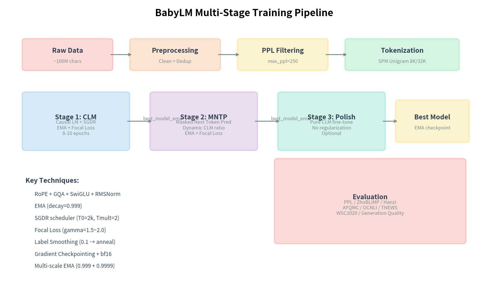

# BabyLLM — 从零预训练中文语言模型

[](https://chinese-babylm.github.io/)
[](https://www.python.org/)
[](https://pytorch.org/)
[](LICENSE)
[](#核心成果与基准测试)

> 首届 ChineseBabyLM 挑战赛参赛项目 · SULAB 团队
>
> 在约 1 亿中文字符上从零预训练高性能小型语言模型，历经 **15 个版本迭代**，PPL 从 597 降至 **38.68**，降幅达 93.5%。

---

## 目录

- [项目概述](#项目概述)
- [核心成果与基准测试](#核心成果与基准测试)
- [技术架构](#技术架构)
- [项目结构](#项目结构)
- [环境配置](#环境配置)
- [快速开始](#快速开始)
- [详细使用说明](#详细使用说明)
- [版本历史](#版本历史)
- [实验结果深度分析](#实验结果深度分析)
- [已知问题与后续工作](#已知问题与后续工作)
- [常见问题](#常见问题)
- [贡献指南](#贡献指南)
- [技术文档索引](#技术文档索引)
- [许可证](#许可证)
- [引用格式](#引用格式)
- [参考文献](#参考文献)
- [联系方式](#联系方式)

---

## 项目概述

本项目参与首届 **ChineseBabyLM 挑战赛**（NLPCC 2026），目标是在约 1 亿中文字符的儿童语料上，从零预训练一个高性能的小型中文语言模型。项目历时约 23 天，完成了 15 个版本的迭代优化，系统探索了架构设计、分词器选择、训练策略、数据工程等多个维度。

### 挑战赛信息

| 项目 | 详情 |
|:-----|:-----|
| 挑战赛 | NLPCC 2026 ChineseBabyLM Challenge |
| 主页 | <https://chinese-babylm.github.io/> |
| 训练数据 | [babylm-zho-100M](https://huggingface.co/datasets/chinese-babylm-org/babylm-zho-100M) (~100M 中文字符, ~2M 行) |
| 评测代码 | [evaluation-pipeline-2025](https://github.com/SiyuanSong2004/evaluation-pipeline-2025) |
| 核心约束 | 从零预训练，不可使用外部预训练模型 |
| Token 限制 | ≤100M Jieba tokens |
| 训练周期 | 2026-04-19 至 2026-05-12 (~23 天) |

### 核心矛盾

100M tokens 的数据量远低于 Chinchilla 最优比例（tokens/params = 20–200×），这意味着模型参数量必须严格控制在合理范围内才能充分训练。项目通过反复实验验证：**对 100M tokens，最优参数量为 40–55M（tokens/param ≈ 1.8–2.5×）**。

---

## 核心成果与基准测试

### 关键指标总览

| 指标 | 数值 | 说明 |
|:-----|:-----|:-----|
| **最佳 PPL** | **38.68** | V13 Stage 2 EMA, 94.2M 参数 |
| 最佳参数效率 | PPL=38.84 | V12, 54.2M 参数, PPL/10M=7.17 |
| PPL 改善幅度 | 597 → 38.68 | V2→V13, 降幅 **93.5%** |
| 版本迭代 | 15 个版本 | V1–V15, 历时 ~3 周 |
| ZhoBLiMP 平均 | 63.5% | 15 个语言学维度 |
| AFQMC (语义相似度) | 69.0% | 竞赛基线 70.2% |
| OCNLI (自然语言推理) | 64.0–66.0% | — |
| TNEWS (新闻分类) | 53.9–54.4% | 15 类分类 |
| CLUEWSC (共指消解) | 63.5–63.8% | — |

### 版本演进时间线


*V1–V15 版本演进时间线，标注每个版本的关键创新与 PPL 指标。*

---

### PPL 演进趋势


*各版本最佳验证集 PPL（对数刻度）。从 V2 的 597 到 V13 的 38.68，整体降幅达 93.5%。*

---

### 参数效率前沿


*参数量与 PPL 的关系。红色虚线为帕累托前沿（最低 PPL/参数量比）。*

---

### 参数效率（PPL per 10M Params）


*每个版本的参数效率（PPL / 10M params）。V12 是效率之王。*

---

### 官方评测结果


*V13、V14、V15 在 CLUE 基准任务上的雷达图对比。*

| 版本 | ZhoBLiMP | 汉字结构 | 汉字拼音 | AFQMC | OCNLI | TNEWS | WSC2020 |
|:-----|:---------|:---------|:---------|:------|:------|:------|:--------|
| **V13** | 63.5 | 64.7 | 49.5 | 69.0 | 64.0 | 53.9 | 63.5 |
| **V14** | 64.3 | 62.4 | 41.9 | 69.0 | 66.0 | 54.1 | 63.5 |
| **V15** | 62.4 | 63.9 | 47.4 | 69.0 | 65.9 | 54.4 | 63.8 |

---

### 分阶段 PPL 改进


*V10–V15 每个训练阶段的 PPL 改进。CLM→MNTP 是核心改进阶段，后续阶段边际收益递减。*

---

### 技术贡献分析


*各关键技术对 PPL 改善的估计贡献占比。SPM 分词器是单一最大改进来源。*

---

### 完整版本对比表

| 版本 | 架构 | 隐藏维度 | 层数 | Q 头 | KV 头 | 参数量 | 最佳 PPL | 最佳阶段 | 状态 |
|:-----|:-----|:---------|:-----|:-----|:------|:-------|:---------|:---------|:-----|
| V1 | GPT-2 | 768 | 12 | 12 | — | ~110M | ~343 | best_model | 完成 |
| V2 | LLaMA | 768 | 12 | 12 | 4 | ~125M | 597 | best_model | 完成 |
| V3 | LLaMA | 768 | 12 | 12 | 4 | ~125M | 542 | — | **失败** (NCCL) |
| V4 | LLaMA-deep | 1024 | 24 | 16 | 8 | ~350M | N/A | — | **失败** (过大) |
| V5 | LLaMA-small | 512 | 12 | 8 | 4 | ~51M | 525 | best_model | 完成 |
| V6 | LLaMA | 640 | 12 | 10 | 5 | ~75M | N/A | — | **失败** (数据丢失) |
| V7 | LLaMA | 448 | 12 | 8 | 4 | ~30M | 50.8 | best_model | 完成 |
| V8 | LLaMA | 512 | 12 | 8 | 4 | ~35M | 50.8 | stage3_polish | 完成 |
| V9 | LLaMA | 512 | 12 | 8 | 4 | ~35M | 50.8 | polish_probe | 完成 |
| V10 | LLaMA | 512 | 12 | 8 | 4 | 38.7M | 42.9 | stage3_polish | 完成 |
| V11 | LLaMA | 512 | 12 | 8 | 4 | 38.7M | 40.7 | stage5_sd_ema | 完成 |
| V12 | LLaMA | 576 | 14 | 9 | 3 | 54.2M | **38.8** | stage2_mntp_ema | 完成 (效率最佳) |
| **V13** | **LLaMA** | **768** | **14** | **12** | **4** | **94.2M** | **38.7** | **stage2_mntp_ema** | **SOTA** |
| V14 | LLaMA | 640 | 12 | 10 | 5 | 59.2M | 41.8 | stage4_sd | 完成 |
| V15 | LLaMA | 640 | 14 | 10 | 5 | 68.2M | 45.1 | stage2_mntp_ema | 完成 |

---

## 技术架构

### 模型架构（以 V13 SOTA 为例）

```
LlamaForCausalLM (94.2M params)
├── Tokenizer: SentencePiece Unigram (32K vocab)
├── Embedding: 768d (tied with LM head, 节省 ~24.6M 参数)
├── Transformer Blocks × 14
│   ├── RMSNorm (eps=1e-5, Pre-Norm)
│   ├── Self-Attention (SDPA)
│   │   ├── Q: 12 heads × 64d = 768d
│   │   ├── K:  4 heads × 64d = 256d  (GQA, 3:1 压缩)
│   │   ├── V:  4 heads × 64d = 256d
│   │   └── RoPE (base=10000, max_pos=1024)
│   ├── RMSNorm
│   └── FFN (SwiGLU)
│       ├── Gate: 768d → 2048d
│       ├── Up:   768d → 2048d
│       └── Down: 2048d → 768d
├── RMSNorm (final)
└── LM Head (768d → 32K, tied)
```

### 架构演进：GPT-2 → LLaMA

| 组件 | GPT-2 (V1) | LLaMA (V2+) | 收益 |
|:-----|:-----------|:------------|:-----|
| 位置编码 | Learned Absolute (512) | RoPE (θ=10000) | 零参数, 相对位置, 长度外推 |
| 注意力 | MHA 12 heads | GQA 12Q/4KV | 3× KV 缓存减少 |
| 激活函数 | GELU | SwiGLU | 门控机制, 更好表达力 |
| 归一化 | LayerNorm (Post) | RMSNorm (Pre) | 70% 计算量, 更好梯度流 |
| FFN 维度 | 4×d (3072) | 8/3×d (2048) | SwiGLU 3 投影下相同参数 |

### 训练流水线



*多阶段训练流水线：数据预处理 → Stage 1 (CLM) → Stage 2 (MNTP) → Stage 3 (Polish, 可选) → 评估。*

#### Stage 1: Causal Language Modeling (CLM)
- **目标**: 标准因果语言模型预训练
- **调度器**: SGDR（带热重启的余弦退火, T_mult=2）
- **关键技术**: Focal Loss (γ=1.5–2.0), EMA (decay=0.999), Label Smoothing 退火, BPE Dropout

#### Stage 2: Masked Next Token Prediction (MNTP)
- **目标**: 掩码下一词预测混合训练（CLM:MNTP 动态比例）
- **关键技术**: Dynamic CLM ratio (25%→12.5%→6.25%), Mask ratio 退火 (0.25→0.10), Focal Loss (γ=1.0–1.5)

#### Stage 3: Polish (可选)
- **目标**: 低学习率精细调整
- **发现**: V13 证明此阶段在低 LR 下添加 DropBlock/StochDepth 是负面优化，后续版本已移除

### 关键训练技术

| 技术 | 说明 | 引入版本 | 估计 PPL 改善 |
|:-----|:-----|:---------|:-------------|
| **SentencePiece 分词器** | 从 BPE 迁移到 SPM Unigram, 32K 词表 | V3 | ~74% |
| **MNTP 混合训练** | CLM + Masked Next Token Prediction | V7 | ~16% |
| **EMA 权重平均** | 指数移动平均 (decay=0.999) | V11 | ~7% |
| **SGDR 学习率** | 带热重启的余弦退火 (T_mult=2) | V1(bug), V11 | ~5% |
| **Focal Loss** | 聚焦困难样本, γ=1.5–2.0 | V12 | ~5% |
| **PPL 数据过滤** | 用已有模型过滤低质量数据 (max_ppl=250) | V13 | ~4% |
| **Label Smoothing 退火** | 标签平滑 (0.1→退火至 0) | V10 | ~2% |
| **BPE Dropout** | 免费数据增强 (p=0.1) | V2 | ~2% |
| **动态 CLM 比例** | 课程学习, 随训练递减 | V11 | ~2% |
| **GQA 注意力** | 分组查询注意力 (3:1 ratio) | V7 | 减少 KV 参数 |
| **bf16 混合精度** | Brain Float 16 训练 | V2 | 2× 吞吐量 |

---

## 项目结构

```
babyllm/
├── README.md                              # 本文档
│
├── babyLLM/                               # 主训练代码
│   ├── README.md                          # 详细技术文档
│   ├── REPORT.md                          # 实验报告
│   ├── requirements.txt                   # Python 依赖
│   ├── accelerate_config_v14.yaml         # Accelerate 配置
│   │
│   ├── src/                               # 各版本源代码
│   │   ├── v1/                            # V1: GPT-2 基线
│   │   ├── v2/                            # V2: LLaMA 架构迁移
│   │   ├── v3/                            # V3: SPM 分词器 (NCCL 失败)
│   │   ├── v4/                            # V4: 深层模型 (参数过多)
│   │   ├── v5/                            # V5: 小模型 + 知识蒸馏
│   │   ├── v6/                            # V6: 3 阶段流水线 (数据丢失)
│   │   ├── v7/                            # V7: MNTP 混合训练
│   │   ├── v8/                            # V8: 简化 3 阶段
│   │   ├── v9/                            # V9: 探针实验
│   │   ├── v10/                           # V10: 生产管线
│   │   ├── v11/                           # V11: EMA + SGDR + Self-Distill
│   │   ├── v12/                           # V12: Focal Loss + 数据清洗
│   │   ├── v13/                           # V13: PPL 过滤 (SOTA)
│   │   ├── v14/                           # V14: 效率版
│   │   ├── v15/                           # V15: 优化架构
│   │   ├── analyze_versions.py            # 版本分析脚本
│   │   └── eval_standardized.py           # 标准化评估脚本
│   │
│   ├── docs/                              # 技术文档与可视化
│   │   ├── assets/                        # 可视化图表 (PNG)
│   │   │   ├── ppl_evolution.png
│   │   │   ├── params_vs_ppl.png
│   │   │   ├── version_timeline.png
│   │   │   ├── training_pipeline.png
│   │   │   ├── official_eval_radar.png
│   │   │   ├── ppl_by_stage.png
│   │   │   ├── efficiency_frontier.png
│   │   │   └── technique_impact.png
│   │   ├── generate_charts.py             # 图表生成脚本
│   │   ├── V1_V14_COMPREHENSIVE_ANALYSIS.md
│   │   ├── V1_V14_TRAINING_EXPERIENCE.md
│   │   ├── V1_V14_STANDARDIZED_EVAL.md
│   │   ├── V13_DEEP_ANALYSIS_REPORT.md
│   │   └── V15_TRAINING_PROTOCOL.md
│   │
│   ├── data/                              # 数据目录 (gitignored)
│   ├── logs/                              # 训练日志
│   ├── plans/                             # 规划文档
│   ├── launch_v10_pipeline.sh             # V10 训练脚本
│   ├── launch_v11_pipeline.sh             # V11 训练脚本
│   ├── launch_v12_pipeline.sh             # V12 训练脚本
│   ├── launch_v13_pipeline.sh             # V13 训练脚本 (SOTA)
│   ├── launch_v14_pipeline.sh             # V14 训练脚本
│   └── launch_v15_pipeline.sh             # V15 训练脚本
│
├── chinese-babylm-eval-pipeline/          # 官方评测流水线
│   ├── evaluation_pipeline/               # 评测脚本
│   ├── pipeline.py                        # 集成评测流水线
│   └── README.md                          # 评测文档
│
└── docs/                                  # 顶层研究文档
    └── SOTA_TECHNIQUES_RESEARCH.md        # SOTA 技术研究
```

---

## 环境配置

### 硬件要求

| 项目 | 最低配置 | 推荐配置 (本项目) |
|:-----|:---------|:-----------------|
| GPU | 1× NVIDIA GPU (16GB+ VRAM) | 4× NVIDIA RTX A6000 (48GB) |
| CPU | 8+ 核 | 32 核 |
| RAM | 32GB | 128GB+ |
| 存储 | 50GB SSD | 200GB SSD + HDD |
| CUDA | 11.8+ | 12.4 |

### 软件依赖

```
torch>=2.0.0
transformers>=4.30.0
tokenizers>=0.13.0
datasets>=2.14.0
accelerate>=0.21.0
sentencepiece>=0.1.99
jieba>=0.42.1
tqdm>=4.65.0
matplotlib>=3.7.0
scikit-learn>=1.3.0
scipy>=1.11.0
wandb>=0.15.0
```

### 安装步骤

```bash
# 1. 克隆仓库 (sulab 分支)
git clone -b sulab https://github.com/C5-jpg/babyLLM.git babyllm
cd babyllm

# 2. 创建 conda 环境
conda create -n babylm python=3.10 -y
conda activate babylm

# 3. 安装 PyTorch (CUDA 12.4)
pip install torch torchvision torchaudio --index-url https://download.pytorch.org/whl/cu124

# 4. 安装项目依赖
cd babyLLM
pip install -r requirements.txt

# 5. 验证 GPU 环境
python -c "import torch; print(f'CUDA: {torch.cuda.is_available()}, GPUs: {torch.cuda.device_count()}')"

# 6. 登录 WandB (可选, 用于训练监控)
wandb login
```

---

## 快速开始

### 1. 下载数据

```bash
# 从 HuggingFace 下载训练数据
python -c "
from datasets import load_dataset
ds = load_dataset('chinese-babylm-org/babylm-zho-100M')
ds['train'].to_json('data/raw/train.jsonl')
"
```

### 2. 准备数据和分词器

```bash
cd babyLLM

# 使用 V13 的数据准备脚本 (含 PPL 过滤)
python src/v13/prepare_data.py \
    --input_dir data/raw \
    --output_dir data/processed_v13 \
    --tokenizer_dir data/tokenizer_v7

# 或使用 V15 的数据准备脚本 (含 PPL 过滤 + MinHash 去重)
python src/v15/prepare_data.py \
    --input_dir data/processed_v7 \
    --output_dir data/processed_v15 \
    --model_path /path/to/v13/best_model_ema \
    --tokenizer_dir data/tokenizer_v7 \
    --max_ppl 250 --hard_upsample_factor 2
```

### 3. 训练模型

**方式一：一键启动流水线（推荐）**

```bash
# V13 SOTA 训练
bash launch_v13_pipeline.sh

# V15 最新训练
bash launch_v15_pipeline.sh
```

**方式二：分阶段手动训练（以 V13 为例）**

```bash
# Stage 1: CLM + SGDR
python src/v13/train_v13.py \
    --stage clm --d_model 768 --n_layer 14 --n_head 12 --n_kv_heads 4 \
    --lr 6e-4 --epochs 8 --scheduler sgdr \
    --focal_loss --focal_gamma 1.5 --use_ema \
    --data_dir data/processed_v13 \
    --output_dir output/babylm-v13/stage1_clm_sgdr

# Stage 2: MNTP
python src/v13/train_v13.py \
    --stage mntp \
    --resume_from output/babylm-v13/stage1_clm_sgdr/best_model_ema \
    --lr 5e-4 --epochs 10 --dynamic_clm_ratio \
    --output_dir output/babylm-v13/stage2_mntp
```

### 4. 评估模型

```bash
python src/v13/evaluate_v13.py \
    --model_path output/babylm-v13/stage2_mntp/best_model_ema \
    --data_path data/processed_v13/val.txt \
    --tokenizer_dir data/tokenizer_v7
```

### 5. 生成可视化图表（可选）

```bash
python docs/generate_charts.py
# 图表将保存到 babyLLM/docs/assets/*.png
```

---

## 详细使用说明

### 训练脚本参数

| 参数 | 说明 | 默认值 |
|:-----|:-----|:-------|
| `--stage` | 训练阶段 (`clm` / `mntp`) | `clm` |
| `--d_model` | 隐藏维度 | 768 |
| `--n_layer` | Transformer 层数 | 14 |
| `--n_head` | 注意力头数 | 12 |
| `--n_kv_heads` | KV 头数 (GQA) | 4 |
| `--lr` | 学习率 | 6e-4 |
| `--epochs` | 训练轮数 | 8 |
| `--batch_size` | 每 GPU 批大小 | 16 |
| `--grad_accum_steps` | 梯度累积步数 | 2 |
| `--max_length` | 最大序列长度 | 1024 |
| `--stride` | 滑动窗口步长 | 512 |
| `--scheduler` | 学习率调度器 (`cosine` / `sgdr`) | `sgdr` |
| `--focal_loss` | 启用 Focal Loss | False |
| `--focal_gamma` | Focal Loss gamma | 2.0 |
| `--use_ema` | 启用 EMA | False |
| `--ema_decay` | EMA 衰减率 | 0.999 |
| `--label_smoothing` | 标签平滑系数 | 0.1 |
| `--label_smoothing_anneal` | 标签平滑退火 | False |
| `--attention_dropout` | 注意力 Dropout | 0.1 |
| `--dynamic_clm_ratio` | 动态 CLM 比例 (MNTP 阶段) | False |
| `--mask_ratio_start` | 起始掩码比例 | 0.25 |
| `--mask_ratio_end` | 终止掩码比例 | 0.1 |
| `--bpe_dropout` | BPE Dropout | 0.1 |
| `--patience` | 早停耐心值 | 3 |
| `--eval_steps` | 评估间隔步数 | 200 |

### 从检查点接续训练

```bash
# 查看可用检查点
ls output/babylm-*/checkpoints/

# 恢复训练
accelerate launch --num_processes=4 --mixed_precision=bf16 \
    src/v13/train_v13.py \
    --stage clm \
    --resume_from_checkpoint output/babylm-v13/stage1_clm_sgdr/latest_checkpoint \
    --data_dir data/processed_v13 \
    --output_dir output/babylm-v13/stage1_clm_sgdr
```

### 检查点管理

检查点保存在 `output/<model_name>/`：
- `best_model/`: 验证集 loss 最低的模型
- `best_model_ema/`: EMA 版本的最佳模型
- `latest_checkpoint/`: 最新检查点（用于断点续训）
- 每个检查点包含：`model.safetensors`, `optimizer.pt`, `scheduler.pt`, `trainer_state.json`

### 数据预处理流程

```
原始数据 (babylm-zho-100M, ~2M 行)
    │
    ▼
清洗: 去除过短行 (≤2 chars), 中文字符比例过滤
    │
    ▼
去重: MD5 精确去重 + MinHash 近似去重 (threshold=0.7)
    │
    ▼
PPL 过滤 (V13+): 用已训练模型计算每行 PPL, 过滤 max_ppl=250
    │
    ▼
硬样本上采样: PPL>80 的样本 ×2
    │
    ▼
Tokenization: SentencePiece Unigram (32K vocab)
    │
    ▼
分块: 滑动窗口 (max_length=1024, stride=512, 50% 重叠)
    │
    ▼
分割: 95% 训练 / 5% 验证
```

---

## 版本历史

### 成功版本 (V7–V15)

| 版本 | 日期 | 关键创新 | PPL | 参数量 | 训练时长 |
|:-----|:-----|:---------|:----|:-------|:---------|
| **V7** | 2026-04-23 | MNTP 混合训练, 8K 词表 | 50.8 | 30M | — |
| **V8** | 2026-04-24 | 简化 3 阶段流水线 | 50.8 | 35M | — |
| **V9** | 2026-04-25 | 探针实验 (stride, smoothing) | 50.8 | 35M | — |
| **V10** | 2026-04-26 | 生产管线, SPM Unigram 32K | 42.9 | 38.7M | 2h36m |
| **V11** | 2026-04-26 | EMA + SGDR + 自蒸馏 | 40.7 | 38.7M | 4h46m |
| **V12** | 2026-04-27 | Focal Loss + 数据清洗, **效率之王** | **38.8** | 54.2M | 8h52m |
| **V13** | 2026-04-28 | PPL 数据过滤, 最大模型, **SOTA** | **38.7** | **94.2M** | 9h34m |
| **V14** | 2026-04-29 | 效率版, 5 阶段流水线 | 41.8 | 59.2M | 2h42m |
| **V15** | 2026-05-12 | 深层架构 (14L), Multi-scale EMA | 45.1 | 68.2M | 3h25m |

### 失败版本 (V1–V6) 与教训

| 版本 | 失败原因 | 教训 |
|:-----|:---------|:-----|
| **V1** | GPT-2 架构限制, LR 调度器 bug | Bug 意外创造了 SGDR 效果 (PPL -30%), 后被有意实现 |
| **V2** | ByteLevel BPE 不适合中文 | 分词器选择 > 架构选择, ~74% PPL 影响 |
| **V3** | NCCL 通信超时 | 分布式训练需要正确的环境变量配置 |
| **V4** | 350M 参数过大, tokens/param=0.23 | Chinchilla scaling law: 不增加数据就不要增加参数 |
| **V5** | SSD 满导致权重保存静默失败 | 必须验证 `model.safetensors` 存在且大小正确 |
| **V6** | 过度数据清洗导致 79% 数据丢失 | 数据清洗应保守, 宁可保留噪声也不要丢失有用数据 |

### 版本关系图

```
V1 (GPT-2) ──→ V2 (LLaMA) ──→ V3 (SPM) ──→ V4 (Deep, failed)
                                    │
                                    ├──→ V5 (Small + KD)
                                    │      │
                                    │      └──→ V6 (3-stage, data lost)
                                    │
                                    └──→ V7 (MNTP) ──→ V8 (3-stage) ──→ V9 (Probes)
                                                              │
                                                              └──→ V10 (Production)
                                                                      │
                                                                      ├──→ V11 (EMA+SGDR)
                                                                      │
                                                                      ├──→ V12 (Focal Loss) ──→ V13 (PPL Filter, SOTA)
                                                                      │
                                                                      └──→ V14 (Efficiency) ──→ V15 (Optimized)
```

---

## 实验结果深度分析

### ZhoBLiMP 评测详情 (V13, 15 维度)

| 维度 | V13 | V12 | V11 | 随机基线 |
|:-----|:----|:----|:----|:---------|
| BA (绑定分析) | 75.33 | 74.36 | 76.33 | 50.0 |
| question (疑问句) | 64.41 | 68.78 | 63.05 | 50.0 |
| nominal_expression | 75.85 | 72.58 | 71.82 | 50.0 |
| classifier (量词) | 77.78 | 79.11 | 74.44 | 50.0 |
| npi_licensing | 46.67 | 40.70 | 42.37 | 50.0 |
| topicalization | 63.50 | 54.00 | 60.33 | 50.0 |
| verb_phrase | 75.17 | 77.57 | 79.81 | 50.0 |
| anaphor (回指) | 35.00 | 37.33 | 36.44 | 50.0 |
| passive (被动) | 37.03 | 30.69 | 32.50 | 50.0 |
| argument_structure | 64.05 | 60.67 | 63.19 | 50.0 |
| ellipsis (省略) | 71.00 | 72.11 | 66.56 | 50.0 |
| control_raising | 70.42 | 62.83 | 64.50 | 50.0 |
| relativization | 55.25 | 56.25 | 51.92 | 50.0 |
| fci_licensing | 75.13 | 63.67 | 66.13 | 50.0 |
| quantifiers | 84.67 | 88.00 | 98.17 | 50.0 |
| **平均** | **63.47** | **62.03** | **61.97** | **50.0** |

**诊断**: 模型表现出双峰准确率分布（7 个任务 >70%, 7 个任务 <50%）。模型擅长浅层模式匹配（词汇线索、量词搭配），但在深层句法推理（回指一致、NPI 许可、被动结构）上完全失败。

### 微调评测结果

| 任务 | 类型 | V13 | V12 | V11 | 随机 |
|:-----|:-----|:----|:----|:----|:-----|
| AFQMC | 语义相似度 | 69.00% | 69.00% | 69.07% | 50.0% |
| TNEWS | 新闻分类 (15类) | 53.89% | 53.60% | 53.04% | ~6.7% |
| OCNLI | 自然语言推理 | 64.03% | 64.47% | 64.71% | ~33.3% |
| CLUEWSC | 共指消解 | 63.49% | 63.49% | 63.49% | 50.0% |

**注意**: CLUEWSC 在所有版本中完全相同（63.49%, F1=0.7767, MCC=0.0），说明模型学习了浅层启发式而非真正的共指解析。

### 训练效率分析

| 版本 | 初始 PPL | 最终 PPL | 改善 | 训练时间 | PPL/小时 |
|:-----|:---------|:---------|:-----|:---------|:---------|
| V2 | 1644 | 597 | -1047 | 7.5h | ~140 |
| V10 | 55.60 | 42.89 | -12.71 | 1.5h | ~8.5 |
| V11 | 45.44 | 40.73 | -4.71 | 4.8h | ~1.0 |
| V12 | 41.20 | 38.84 | -2.36 | 7.5h | ~0.3 |
| V13 | 42.19 | 38.68 | -3.51 | 7.7h | ~0.45 |

**观察**: 随着 PPL 接近饱和，改善效率急剧下降。

### 参数效率分析

| 版本 | 参数量 | 最佳 PPL | PPL/10M 参数 | tokens/param | 排名 |
|:-----|:-------|:---------|:-------------|:-------------|:-----|
| V11 | 38.7M | 40.73 | 10.53 | 2.6× | 1 (最佳效率) |
| V12 | 54.2M | 38.84 | 7.17 | 1.9× | 2 |
| V10 | 38.7M | 42.89 | 11.09 | 2.6× | 3 |
| V13 | 94.2M | 38.68 | 4.11 | 1.1× | 4 (最差效率) |

---

## 已知问题与后续工作

### 已知问题

1. **V15 PPL 回归**: V15 (PPL=45.14) 未超越 V13 (PPL=38.68)。可能原因: `intermediate_size=1706` 未对齐到 256 的倍数; 使用 V14 的 PPL 过滤数据（比 V13 数据少了 43K 行）; 学习率 5e-4 偏低
2. **ZhoBLiMP 弱维度**: anaphor (35%), passive (37%), npi_licensing (46.67%) 低于随机基线
3. **CLUEWSC 不变**: 所有版本均获得 63.49%（MCC=0.0），说明模型学习了浅层启发式
4. **贪婪解码崩溃**: 所有版本的贪婪解码均产生 token 级重复
5. **V14 未完成**: 仅完成 Stage 1-2 (PPL=44.12), Stage 3-5 训练中断

### 后续工作优先级

| 优先级 | 方向 | 具体措施 |
|:-------|:-----|:---------|
| P1 | 缩小模型 + 提升数据效率 | d_model 768→576-640, n_layer 14→12, 目标 ~45-55M, tokens/param 2.0× |
| P2 | 数据增强 | 语法模式上采样 1.5×, PPL 过滤阈值放宽 (200→300-500), 领域平衡 |
| P3 | 移除 Stage 3 Polish | V13 证明无效, 使用 2 阶段管线: CLM→MNTP |
| P4 | 超参数调优 | LR 网格搜索 3e-4~1e-3, Batch 增大到 48-64, SGDR t_mult=1~1.5 |
| P5 | 架构改进 | RoPE base 10000→500000, 词表 32K→16K, 逐层学习率 |

---

## 常见问题

### Q: 为什么 V4 的 350M 参数模型表现不好？

V4 违反了 **Chinchilla scaling law**。100M tokens 对于 350M 参数来说太少（tokens/param = 0.23），导致严重欠训练。实验验证最佳比例约为 tokens/param ≈ 1.8–2.5×。

### Q: 分词器选择为什么如此重要？

ByteLevel BPE（V2）将每个中文字符拆分为 3 个 UTF-8 字节，信息密度降低 3.4×，导致 PPL 恶化 74%。这一负面影响完全抵消了 LLaMA 架构相比 GPT-2 的所有优势。SentencePiece Unigram（V3+）在字级别处理中文，是正确的选择。

### Q: MNTP 混合训练为什么有效？

CLM 只能看到左侧上下文，而 MNTP 通过随机掩码强制模型利用双向上下文信息。两者结合提供了更全面的语言理解能力，这也是 GPT-BERT 2024 冠军的核心技术。

### Q: EMA 和 SWA 有什么区别？

- **EMA** (Exponential Moving Average): 在线平均权重，每个训练步更新，decay=0.999。在 Stage 1（高 LR、高噪声）效果最显著（8.4% PPL 改善）
- **SWA** (Stochastic Weight Averaging): 离线周期性采样模型权重取平均。V11 实验显示收益微弱（0.02% 差异）

### Q: 为什么所有版本在 epoch 6-10 后过拟合？

100M tokens 的数据量有限，仅支持约 6-10 个有效训练 epoch。之后模型开始记忆训练数据而非学习通用语言模式。这是项目的根本约束。

### Q: 训练过程中 OOM 怎么办？

1. 减小 `--batch_size`（如 16→8）
2. 增加 `--grad_accum_steps` 保持等效批大小
3. 启用 `gradient_checkpointing`（默认已开启）
4. 减小 `--max_length`（如 1024→512）
5. V14+ 脚本支持自动 OOM 恢复

---

## 贡献指南

1. Fork 本仓库
2. 创建功能分支 (`git checkout -b feature/v16-improvement`)
3. 提交更改 (`git commit -m 'feat(v16): add new technique'`)
4. 推送到远程 (`git push origin feature/v16-improvement`)
5. 创建 Pull Request

### 代码规范

- Python 3.10+, 遵循 PEP 8
- 使用 type hints
- 每个版本的代码放在独立目录 (`src/vN/`)
- 训练脚本必须支持 `--resume_from` 断点续训
- 评估结果必须包含 ISO 8601 时间戳
- 使用 conventional commits 格式

---

## 技术文档索引

| 文档 | 路径 | 内容 |
|:-----|:-----|:-----|
| 训练经验总结 | `babyLLM/docs/V1_V14_TRAINING_EXPERIENCE.md` | 14 个版本的完整训练经验 (800 行) |
| 综合分析报告 | `babyLLM/docs/V1_V14_COMPREHENSIVE_ANALYSIS.md` | 版本逐个分析 + 最佳实践 |
| 标准化评测结果 | `babyLLM/docs/V1_V14_STANDARDIZED_EVAL.md` | 跨版本 PPL/Loss 对比 |
| V13 深度分析 | `babyLLM/docs/V13_DEEP_ANALYSIS_REPORT.md` | SOTA 模型全生命周期分析 (895 行) |
| V15 训练协议 | `babyLLM/docs/V15_TRAINING_PROTOCOL.md` | V15 设计与超参数详情 |
| SOTA 技术研究 | `docs/SOTA_TECHNIQUES_RESEARCH.md` | 小型语言模型前沿技术 |
| 训练计划 | `babyLLM/plans/` | 各版本训练计划与事后分析 |
| 评测流水线 | `chinese-babylm-eval-pipeline/README.md` | 官方评测使用说明 |

---

## 许可证

本项目采用 [MIT License](LICENSE) 开源许可证。

---

## 引用格式

如果本项目对您的研究有帮助，请引用：

```bibtex
@misc{babylm2026sulab,
  title={BabyLLM: From-Scratch Pre-training of Compact Chinese Language Models},
  author={SULAB Team},
  year={2026},
  howpublished={NLPCC 2026 ChineseBabyLM Challenge},
  url={https://github.com/C5-jpg/babyLLM}
}
```

---

## 参考文献

- Touvron, H. et al. (2023). *LLaMA: Open and Efficient Foundation Language Models*. arXiv:2302.13971
- Su, J. et al. (2021). *RoFormer: Enhanced Transformer with Rotary Position Embedding*. arXiv:2104.09864
- Shazeer, N. (2020). *GLU Variants Improve Transformer*. arXiv:2002.05202
- Zhang, Z. & Sabuncu, M. (2018). *Focal Loss for Dense Object Detection*. arXiv:1708.02002
- Loshchilov, I. & Hutter, F. (2016). *SGDR: Stochastic Gradient Descent with Warm Restarts*. arXiv:1608.03983
- Kudo, T. & Richardson, J. (2018). *SentencePiece: A simple and language independent subword tokenizer and detokenizer for Neural Text Processing*. arXiv:1808.06226
- Hoffmann, J. et al. (2022). *Training Compute-Optimal Large Language Models* (Chinchilla). arXiv:2203.15556

---

## 联系方式

| 渠道 | 链接 |
|:-----|:-----|
| GitHub 仓库 | <https://github.com/C5-jpg/babyLLM> |
| WandB 项目 | <https://wandb.ai/c5galaxies-sjtu-hpc-center/chinese-babylm> |
| 挑战赛主页 | <https://chinese-babylm.github.io/> |
| Issues | <https://github.com/C5-jpg/babyLLM/issues> |

---

*最后更新: 2026-05-13 · 分支: `sulab`*
