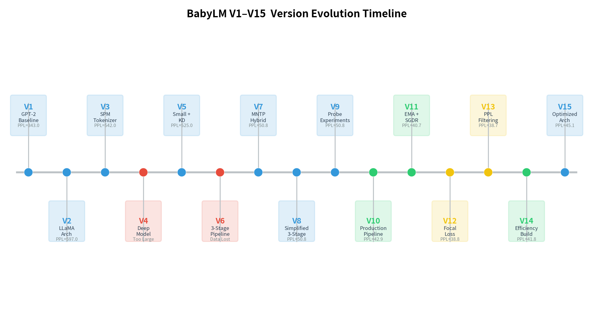
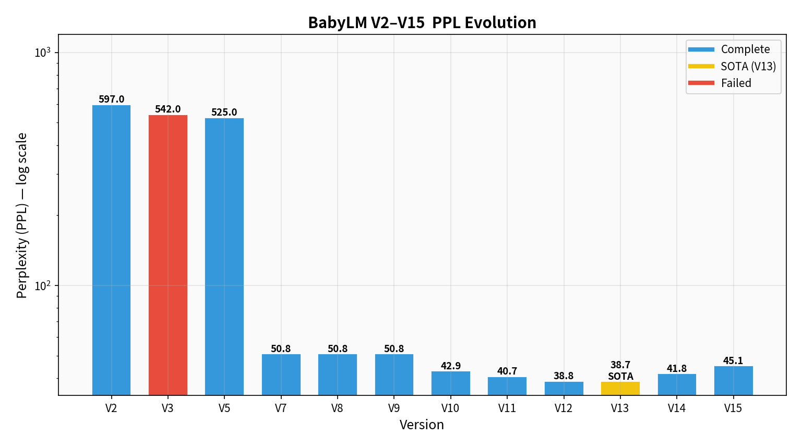
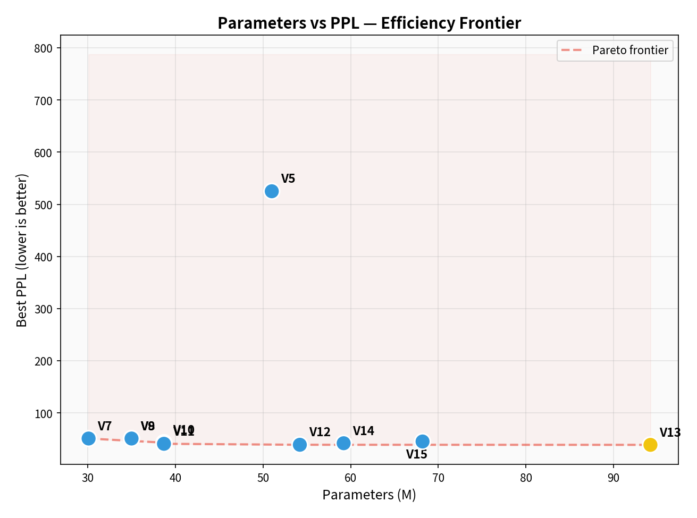
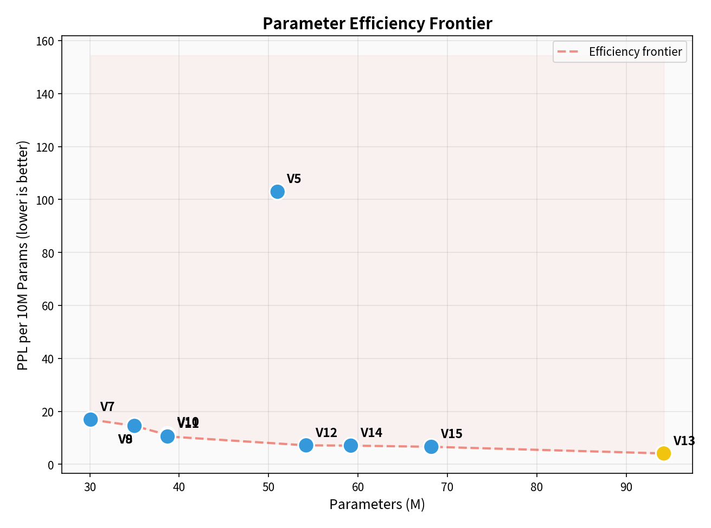
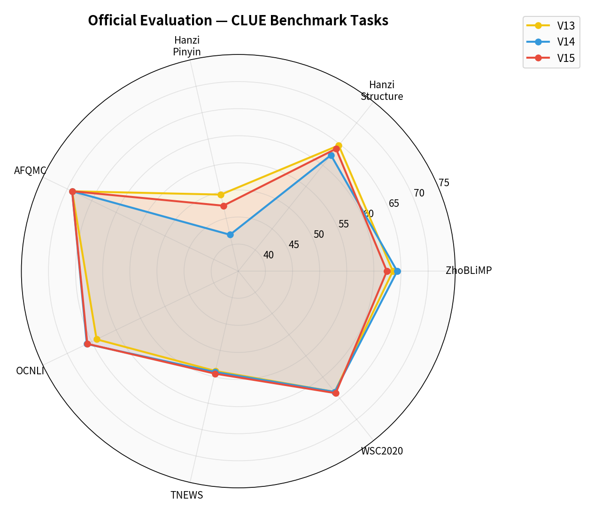
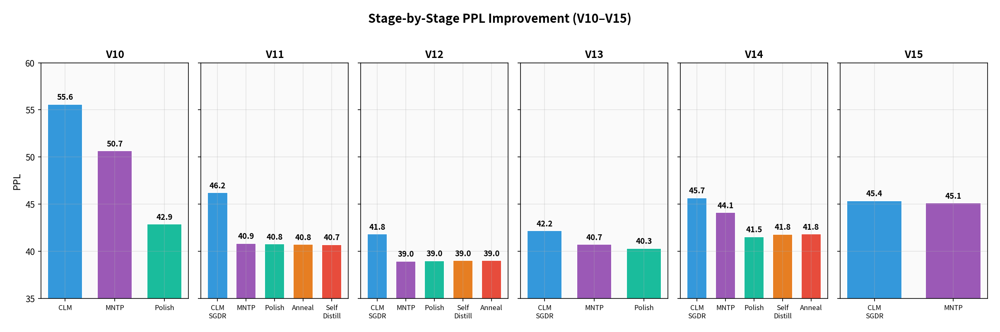
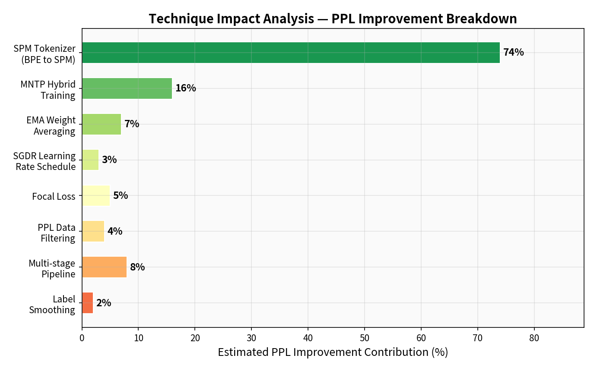

# BabyLLM — 从零预训练中文语言模型 (技术文档)

[](https://chinese-babylm.github.io/)
[](https://www.python.org/)
[](https://pytorch.org/)
[](LICENSE)

> **15 个版本迭代 · PPL 597 → 38.68 · 93.5% 改善**
>
> 本文档为 BabyLLM 项目的技术细节文档，面向开发者和研究人员。
> 项目总览请参见 [根目录 README](../README.md)。

---

## 目录

- [项目概述](#项目概述)
- [核心成果](#核心成果)
- [性能基准测试](#性能基准测试)
- [技术架构](#技术架构)
- [项目结构](#项目结构)
- [环境配置](#环境配置)
- [快速开始](#快速开始)
- [详细使用说明](#详细使用说明)
- [版本历史](#版本历史)
- [超参数经验总结](#超参数经验总结)
- [数据工程](#数据工程)
- [失败模式与教训](#失败模式与教训)
- [常见问题](#常见问题)
- [贡献指南](#贡献指南)
- [许可证](#许可证)
- [参考文献](#参考文献)

---

## 项目概述

本项目参与首届 **ChineseBabyLM 挑战赛**（NLPCC 2026），在 `babylm-zho-100M` 数据集（约 1 亿中文字符）上从头预训练小型中文语言模型。

### 核心约束

| 约束 | 详情 |
|:-----|:-----|
| 数据集 | babylm-zho-100M (~100M 中文字符, ~2M 行) |
| Token 限制 | ≤100M Jieba tokens |
| 预训练约束 | 从零开始，不可使用外部预训练模型 |
| 评测流水线 | [evaluation-pipeline-2025](https://github.com/SiyuanSong2004/evaluation-pipeline-2025) |

### 核心矛盾

100M tokens 远低于 Chinchilla 最优比例（tokens/params = 20–200×）。经实验验证：
- **最优参数量**: 40–55M (tokens/param ≈ 1.8–2.5×)
- **灾难性区域**: <1.0× (V4: 0.23× 完全不收敛)
- **收益递减区域**: 1.0–1.5× (V13: 1.1× 边际收益)

---

## 核心成果

| 指标 | 数值 |
|:-----|:-----|
| **最佳 PPL** | **38.68** (V13, SOTA) |
| 最佳参数效率 | V12: 54M params, PPL=38.84 |
| 版本迭代 | 15 个版本, 历时 ~3 周 |
| PPL 改善 | 597 → 38.68 (**93.5%** 降低) |
| ZhoBLiMP | 63.5% |
| AFQMC | 69.0% |
| OCNLI | 64.0% |

---

## 性能基准测试

### 版本演进时间线



### PPL 演进趋势



### 参数效率前沿



### 参数效率 (PPL per 10M Params)



### 官方评测结果



| 版本 | ZhoBLiMP | 汉字结构 | 汉字拼音 | AFQMC | OCNLI | TNEWS | WSC2020 |
|:-----|:---------|:---------|:---------|:------|:------|:------|:--------|
| **V13** | 63.5 | 64.7 | 49.5 | 69.0 | 64.0 | 53.9 | 63.5 |
| **V14** | 64.3 | 62.4 | 41.9 | 69.0 | 66.0 | 54.1 | 63.5 |
| **V15** | 62.4 | 63.9 | 47.4 | 69.0 | 65.9 | 54.4 | 63.8 |

### 分阶段 PPL 改进



### 技术贡献分析



### 完整版本对比表

| 版本 | 架构 | d_model | n_layer | n_head | n_kv | 参数量 | 最佳 PPL | 最佳阶段 | 状态 |
|:-----|:-----|:--------|:--------|:-------|:-----|:-------|:---------|:---------|:-----|
| V1 | GPT-2 | 768 | 12 | 12 | — | ~110M | ~343 | best_model | 完成 |
| V2 | LLaMA | 768 | 12 | 12 | 4 | ~125M | 597 | best_model | 完成 |
| V3 | LLaMA | 768 | 12 | 12 | 4 | ~125M | 542 | — | **失败** |
| V4 | LLaMA | 1024 | 24 | 16 | 8 | ~350M | N/A | — | **失败** |
| V5 | LLaMA | 512 | 12 | 8 | 4 | ~51M | 525 | best_model | 完成 |
| V6 | LLaMA | 640 | 12 | 10 | 5 | ~75M | N/A | — | **失败** |
| V7 | LLaMA | 448 | 12 | 8 | 4 | ~30M | 50.8 | best_model | 完成 |
| V8 | LLaMA | 512 | 12 | 8 | 4 | ~35M | 50.8 | stage3_polish | 完成 |
| V9 | LLaMA | 512 | 12 | 8 | 4 | ~35M | 50.8 | polish_probe | 完成 |
| V10 | LLaMA | 512 | 12 | 8 | 4 | 38.7M | 42.9 | stage3_polish | 完成 |
| V11 | LLaMA | 512 | 12 | 8 | 4 | 38.7M | 40.7 | stage5_sd_ema | 完成 |
| V12 | LLaMA | 576 | 14 | 9 | 3 | 54.2M | **38.8** | stage2_mntp_ema | 完成 |
| **V13** | **LLaMA** | **768** | **14** | **12** | **4** | **94.2M** | **38.7** | **stage2_mntp_ema** | **SOTA** |
| V14 | LLaMA | 640 | 12 | 10 | 5 | 59.2M | 41.8 | stage4_sd | 完成 |
| V15 | LLaMA | 640 | 14 | 10 | 5 | 68.2M | 45.1 | stage2_mntp_ema | 完成 |

---

## 技术架构

### 模型架构详解（V13 SOTA）

```
LlamaForCausalLM (94,246,656 params)
├── Tokenizer: SPM Unigram (32K vocab)
├── Embedding: 768d (tied with LM head)
├── Transformer Blocks × 14
│   ├── RMSNorm (eps=1e-5, Pre-Norm)
│   ├── Self-Attention (SDPA)
│   │   ├── Q: 12 heads × 64d = 768d
│   │   ├── K:  4 heads × 64d = 256d  (GQA 3:1)
│   │   ├── V:  4 heads × 64d = 256d
│   │   └── RoPE (base=10000, max_pos=1024)
│   ├── RMSNorm
│   └── FFN (SwiGLU)
│       ├── Gate: 768d → 2048d
│       ├── Up:   768d → 2048d
│       └── Down: 2048d → 768d
├── RMSNorm (final)
└── LM Head (768d → 32K, tied)
```

### 关键架构参数

| 参数 | V13 (SOTA) | V12 (效率最佳) | V15 (最新) |
|:-----|:-----------|:--------------|:-----------|
| hidden_size | 768 | 576 | 640 |
| num_layers | 14 | 14 | 14 |
| num_attention_heads | 12 | 9 | 10 |
| num_key_value_heads | 4 | 3 | 5 |
| intermediate_size | 2048 | 1536 | 1706 |
| head_dim | 64 | 64 | 64 |
| vocab_size | 32000 | 32000 | 8000 |
| max_position_embeddings | 1024 | 1024 | 1024 |
| Total Params | 94.2M | 54.2M | 68.2M |
| tie_word_embeddings | True | True | True |

### 训练流水线架构

#### Stage 1: CLM Pretraining

```bash
python src/v13/train_v13.py \
    --stage clm \
    --d_model 768 --n_layer 14 --n_head 12 --n_kv_heads 4 \
    --lr 6e-4 --epochs 8 --batch_size 16 --grad_accum_steps 2 \
    --scheduler sgdr --focal_loss --focal_gamma 1.5 \
    --use_ema --ema_decay 0.999 \
    --label_smoothing 0.1 --label_smoothing_anneal \
    --attention_dropout 0.1 \
    --data_dir /path/to/data_v13 \
    --output_dir /path/to/output/stage1_clm_sgdr
```

| 参数 | Stage 1 (CLM) | Stage 2 (MNTP) | Stage 3 (Polish) |
|:-----|:-------------|:---------------|:-----------------|
| 学习率 | 6e-4 | 5e-4 | 1e-5 |
| 调度器 | SGDR (T_mult=2) | Cosine | Cosine |
| Focal Loss γ | 1.5 | 1.0 | 禁用 |
| Label Smoothing | 0.1→退火 | 0.05→退火 | 0.01 |
| BPE Dropout | 0.1 | 0.1 | 0.0 |
| Attention Dropout | 0.1 | 0.05 | 0.0 |
| EMA Decay | 0.999 | 0.999 | 0.999 |
| Early Stop Patience | 3-5 | 8-10 | 3-5 |

### 关键训练技术

| 技术 | 说明 | 版本引入 | PPL 改善 |
|:-----|:-----|:---------|:---------|
| **SentencePiece** | SPM Unigram 32K 词表 | V3 | ~74% |
| **MNTP** | CLM + Masked Next Token Prediction | V7 | ~16% |
| **EMA** | 指数移动平均 (decay=0.999) | V11 | ~7% |
| **SGDR** | 带热重启的余弦退火 | V1(bug), V11 | ~5% |
| **Focal Loss** | 聚焦困难样本 | V12 | ~5% |
| **PPL 过滤** | 模型驱动的数据质量过滤 | V13 | ~4% |
| **Label Smoothing** | 标签平滑退火 (0.1→0) | V10 | ~2% |
| **BPE Dropout** | 免费数据增强 (p=0.1) | V2 | ~2% |
| **动态 CLM 比例** | 课程学习 | V11 | ~2% |

---

## 项目结构

```
babyLLM/
├── README.md                          # 本文档
├── REPORT.md                          # 实验报告
├── requirements.txt                   # Python 依赖
├── .gitignore
├── accelerate_config_v14.yaml         # Accelerate 配置
│
├── src/                               # 各版本源代码
│   ├── v1/                            # V1: GPT-2 基线
│   │   ├── train.py, train_tokenizer.py, evaluate_model.py
│   ├── v2/                            # V2: LLaMA 架构迁移
│   │   ├── train_v2.py, train_tokenizer_v2.py, evaluate_v2.py
│   ├── v3/                            # V3: SPM 分词器
│   │   ├── train_v3.py, spm_tokenizer.py
│   ├── v4/                            # V4: 深层模型
│   │   ├── train_v4.py, ensemble_checkpoints.py
│   ├── v5/                            # V5: 小模型 + KD
│   │   ├── train_v5.py, generate_teacher_logits.py
│   ├── v6/                            # V6: 3 阶段流水线
│   │   ├── train_v6.py, prepare_data_v6.py
│   ├── v7/                            # V7: MNTP 混合训练
│   │   ├── train_v7.py, prepare_data_v7.py, evaluate_v7.py
│   ├── v8/                            # V8: 简化 3 阶段
│   │   ├── train_v8.py, evaluate_v8.py
│   ├── v9/                            # V9: 探针实验
│   │   ├── train_v9.py, evaluate_v9.py
│   ├── v10/                           # V10: 生产管线
│   │   ├── train_v10.py, evaluate_v10.py, notify.py
│   ├── v11/                           # V11: EMA + SGDR + Self-Distill
│   │   ├── train_v11.py, evaluate_v11.py, convert_tokenizer.py, swa_v11.py
│   ├── v12/                           # V12: Focal Loss + 数据清洗
│   │   ├── train_v12.py, evaluate_v12.py, convert_tokenizer.py, clean_data.py
│   ├── v13/                           # V13: PPL 过滤 (SOTA)
│   │   ├── train_v13.py, evaluate_v13.py, convert_tokenizer.py, prepare_data.py
│   ├── v14/                           # V14: 效率版
│   │   ├── train_v14.py, evaluate_v14.py, convert_tokenizer.py, prepare_data.py
│   ├── v15/                           # V15: 优化架构
│   │   ├── train_v15.py, evaluate_v15.py, convert_tokenizer.py, prepare_data.py
│   ├── analyze_versions.py            # 版本分析脚本
│   └── eval_standardized.py           # 标准化评估脚本
│
├── docs/                              # 文档
│   ├── assets/                        # 可视化图表 (PNG)
│   ├── generate_charts.py             # 图表生成脚本
│   ├── V1_V14_COMPREHENSIVE_ANALYSIS.md
│   ├── V1_V14_TRAINING_EXPERIENCE.md
│   ├── V1_V14_STANDARDIZED_EVAL.md
│   ├── V13_DEEP_ANALYSIS_REPORT.md
│   └── V15_TRAINING_PROTOCOL.md
│
├── data/                              # 数据目录 (gitignored)
│   ├── tokenizer_v7/                  # SPM Unigram 分词器
│   └── processed_v7/                  # 预处理数据
│
├── logs/                              # 训练日志
│   ├── standardized_eval_results.json
│   └── *.jsonl                        # 时间戳日志
│
├── plans/                             # 规划文档
│
├── launch_v10_pipeline.sh             # V10 训练脚本
├── launch_v11_pipeline.sh             # V11 训练脚本
├── launch_v12_pipeline.sh             # V12 训练脚本
├── launch_v13_pipeline.sh             # V13 训练脚本 (SOTA)
├── launch_v14_pipeline.sh             # V14 训练脚本
└── launch_v15_pipeline.sh             # V15 训练脚本
```

---

## 环境配置

### 硬件要求

| 项目 | 最低配置 | 推荐配置 |
|:-----|:---------|:---------|
| GPU | 1× NVIDIA GPU (16GB+) | 4× NVIDIA RTX A6000 (48GB) |
| RAM | 32GB | 64GB+ |
| 存储 | 50GB SSD | 200GB SSD + HDD |
| CUDA | 11.8+ | 12.4 |

### 安装步骤

```bash
# 1. 克隆仓库
git clone https://github.com/C5-jpg/babyLLM.git
cd babyLLM

# 2. 创建 conda 环境
conda create -n babylm python=3.10 -y
conda activate babylm

# 3. 安装依赖
pip install -r requirements.txt

# 4. 验证 GPU
python -c "import torch; print(f'CUDA: {torch.cuda.is_available()}, GPUs: {torch.cuda.device_count()}')"

# 5. 配置 Accelerate (4 GPU DDP)
accelerate config  # 或使用提供的配置文件
```

---

## 快速开始

### 1. 下载数据

```bash
python -c "
from datasets import load_dataset
ds = load_dataset('chinese-babylm-org/babylm-zho-100M')
ds['train'].to_json('data/raw/train.jsonl')
"
```

### 2. 准备数据和分词器

```bash
python src/v13/prepare_data.py \
    --input_dir data/raw \
    --output_dir data/processed_v13 \
    --tokenizer_dir data/tokenizer_v7
```

### 3. 训练模型

```bash
# 一键启动 V13 全阶段训练
bash launch_v13_pipeline.sh

# 或启动 V15 最新训练
bash launch_v15_pipeline.sh
```

### 4. 评估模型

```bash
python src/v13/evaluate_v13.py \
    --model_path output/babylm-v13/stage2_mntp/best_model_ema \
    --data_path data/processed_v13/val.txt \
    --tokenizer_dir data/tokenizer_v7
```

### 5. 生成图表

```bash
python docs/generate_charts.py
```

---

## 详细使用说明

### 训练脚本参数

| 参数 | 说明 | 默认值 |
|:-----|:-----|:-------|
| `--stage` | 训练阶段 (`clm` / `mntp`) | `clm` |
| `--d_model` | 隐藏维度 | 768 |
| `--n_layer` | Transformer 层数 | 14 |
| `--n_head` | 注意力头数 | 12 |
| `--n_kv_heads` | KV 头数 (GQA) | 4 |
| `--lr` | 学习率 | 6e-4 |
| `--epochs` | 训练轮数 | 8 |
| `--batch_size` | 每 GPU 批大小 | 16 |
| `--grad_accum_steps` | 梯度累积步数 | 2 |
| `--max_length` | 最大序列长度 | 1024 |
| `--stride` | 滑动窗口步长 | 512 |
| `--scheduler` | 学习率调度器 | `sgdr` |
| `--focal_loss` | 启用 Focal Loss | False |
| `--focal_gamma` | Focal Loss gamma | 2.0 |
| `--use_ema` | 启用 EMA | False |
| `--ema_decay` | EMA 衰减率 | 0.999 |
| `--label_smoothing` | 标签平滑系数 | 0.1 |
| `--label_smoothing_anneal` | 标签平滑退火 | False |
| `--attention_dropout` | 注意力 Dropout | 0.1 |
| `--dynamic_clm_ratio` | 动态 CLM 比例 | False |
| `--mask_ratio_start` | 起始掩码比例 | 0.25 |
| `--mask_ratio_end` | 终止掩码比例 | 0.1 |
| `--bpe_dropout` | BPE Dropout | 0.1 |
| `--patience` | 早停耐心值 | 3 |
| `--eval_steps` | 评估间隔步数 | 200 |

### 多阶段流水线说明

| 阶段 | 目标 | 学习率 | 调度器 | 关键技术 |
|:-----|:-----|:-------|:-------|:---------|
| Stage 1: CLM | 因果语言建模 | 6e-4 | SGDR | Focal Loss, EMA, Label Smoothing |
| Stage 2: MNTP | 掩码下一词预测 | 5e-4 | Cosine | Dynamic CLM ratio, Focal Loss, EMA |
| Stage 3: Polish | 精调 (可选) | 1e-5 | Cosine | 无正则化 (V13 证明 DropBlock 有害) |

### 接续训练

```bash
# 查看可用检查点
ls output/babylm-*/checkpoints/

# 恢复训练
accelerate launch --num_processes=4 --mixed_precision=bf16 \
    src/v13/train_v13.py \
    --resume_from_checkpoint output/babylm-v13/stage1_clm_sgdr/latest_checkpoint \
    --data_dir data/processed_v13 \
    --output_dir output/babylm-v13/stage1_clm_sgdr
```

### 检查点管理

```
output/<model_name>/
├── best_model/              # 验证集 loss 最低的模型
├── best_model_ema/          # EMA 版本的最佳模型
├── latest_checkpoint/       # 最新检查点 (用于断点续训)
└── checkpoint-XXXX/         # 按步数命名的检查点
```

每个检查点包含: `model.safetensors`, `optimizer.pt`, `scheduler.pt`, `trainer_state.json`

---

## 版本历史

### 成功版本

| 版本 | 日期 | 关键创新 | PPL | 参数量 | 训练时长 |
|:-----|:-----|:---------|:----|:-------|:---------|
| **V7** | 04-23 | MNTP 混合训练, 8K 词表 | 50.8 | 30M | — |
| **V8** | 04-24 | 简化 3 阶段流水线 | 50.8 | 35M | — |
| **V9** | 04-25 | 探针实验 | 50.8 | 35M | — |
| **V10** | 04-26 | 生产管线, SPM 32K | 42.9 | 38.7M | 2h36m |
| **V11** | 04-26 | EMA + SGDR + 自蒸馏 | 40.7 | 38.7M | 4h46m |
| **V12** | 04-27 | Focal Loss, **效率之王** | **38.8** | 54.2M | 8h52m |
| **V13** | 04-28 | PPL 过滤, **SOTA** | **38.7** | **94.2M** | 9h34m |
| **V14** | 04-29 | 效率版, 5 阶段 | 41.8 | 59.2M | 2h42m |
| **V15** | 05-12 | 深层架构, Multi-scale EMA | 45.1 | 68.2M | 3h25m |

### 失败版本

| 版本 | 失败原因 | 教训 |
|:-----|:---------|:-----|
| V1 | LR 调度器 bug | Bug 意外创造 SGDR 效果 |
| V2 | ByteLevel BPE 对中文破坏 | 分词器 > 架构 (74% PPL 影响) |
| V3 | NCCL 超时 | 需要正确的环境变量 |
| V4 | 350M 参数过大 | Chinchilla: 不增数据不增参数 |
| V5 | SSD 满, 权重丢失 | 验证文件存在且大小正确 |
| V6 | 过度清洗 -78% 数据 | 数据清洗要保守 |

### 版本关系图

```
V1 (GPT-2) → V2 (LLaMA) → V3 (SPM) → V4 (Deep, failed)
                                 │
                                 ├──→ V5 (Small + KD) → V6 (data lost)
                                 │
                                 └──→ V7 (MNTP) → V8 → V9
                                              │
                                              └──→ V10 → V11 → V12 → V13 (SOTA)
                                                          │
                                                          └──→ V14 → V15
```

---

## 超参数经验总结

### 学习率

| 版本 | Peak LR | 调度器 | 效果 |
|:-----|:--------|:-------|:-----|
| V1 | 6e-4 | Cosine (bug) | Bug 创造 SGDR, PPL -30% |
| V2 | 6e-4 | Cosine | 标准, epoch 7 后过拟合 |
| V3 | 6e-4 | WSD | 稳定阶段鼓励过拟合 |
| V11+ | 6e-4 | SGDR | 有效周期性重启 |

**经验法则**: Peak LR = 6e-4 适合 35–95M 参数模型。SGDR T_mult=2 是有效的默认值。

### Batch Size

| 配置 | Per-GPU | Grad Accum | Effective | GPUs |
|:-----|:--------|:-----------|:----------|:-----|
| V10-V15 | 16 | 2 | 128 | 4 |

**经验法则**: Effective batch = 128 是 100M 数据的合理默认值。

### 正则化配置（按阶段递减）

| 技术 | Stage 1 (CLM) | Stage 2 (MNTP) | Stage 3 (Polish) |
|:-----|:-------------|:---------------|:-----------------|
| Weight Decay | 0.1 | 0.1 | 0.1 |
| Label Smoothing | 0.1→退火 | 0.05→退火 | 0.01 |
| BPE Dropout | 0.1 | 0.1 | 0.0 |
| Attention Dropout | 0.1 | 0.05 | 0.0 |
| Focal Loss γ | 1.5–2.0 | 1.0–1.5 | 禁用 |

**经验法则**: 正则化应随训练阶段递减。Stage 1 需要最强正则化，Stage 3 应几乎无正则化。

---

## 数据工程

### 数据管线演进

| 版本 | 清洗策略 | 数据量变化 | 效果 |
|:-----|:---------|:----------|:-----|
| V1-V2 | MD5 去重 + HTML 清洗 | 2M→1.3M 行 | 基线 |
| V6 | min_length=15, max_length=300 | **-78%** | 灾难性 |
| V12 | min_chars=5, max_repeat_ratio=0.5 | 轻微减少 | 改善 |
| V13 | PPL 过滤 + MinHash + 硬上采样 | 优化 | **最佳** |

### V13 最佳实践

1. **PPL 过滤**: 用 V12 模型计算每行 PPL, 过滤 max_ppl=200
2. **MinHash 去重**: threshold=0.7, 128 permutations, 3-grams
3. **质量过滤**: 最小唯一字符比例 0.1, CJK 比例 ≥0.3, 最小长度 5 字符
4. **硬样本上采样**: PPL>80 的样本 ×2
5. **序列构建**: max_length=1024, stride=512 (50% 重叠), EOS 分隔符

---

## 失败模式与教训

| 类别 | 失败 | 版本 | 影响 |
|:-----|:-----|:-----|:-----|
| **Tokenizer** | ByteLevel BPE 对中文的破坏 | V2 | PPL +74% |
| **规模** | 350M 参数 / 82M tokens | V4 | 完全不收敛 |
| **数据** | 过度清洗丢失 78% 数据 | V6 | 灾难性欠拟合 |
| **存储** | SSD 满导致权重丢失 | V5 | 最佳模型丢失 |
| **训练** | 无早期停止导致过拟合 | V2 | 72% 时间浪费 |
| **正则化** | DropBlock+StochDepth 过度 | V13-S3 | PPL 回退 |

---

## 常见问题

### Q: 为什么 V4 的 350M 参数模型表现不好？

违反 Chinchilla scaling law。100M tokens 对 350M 参数太少 (tokens/param = 0.23)。

### Q: MNTP 混合训练为什么有效？

CLM 只看左侧上下文，MNTP 通过随机掩码利用双向上下文。两者结合提供更全面的语言理解。

### Q: EMA 在哪个阶段最有效？

Stage 1（高 LR、高噪声）效果最显著（8.4% PPL 改善），Stage 3 仅 0.8%。

### Q: 为什么 V15 (PPL=45.14) 未超越 V13 (PPL=38.68)？

1. `intermediate_size=1706` 未对齐到 256 的倍数
2. 使用 V14 的 PPL 过滤数据（少了 43K 行）
3. 学习率 5e-4 偏低（V12/V13 用 6e-4）

### Q: 训练 OOM 怎么办？

1. 减小 `--batch_size` (16→8)
2. 增加 `--grad_accum_steps` 保持等效批大小
3. 减小 `--max_length` (1024→512)
4. V14+ 脚本支持自动 OOM 恢复

---

## 贡献指南

- Python 3.10+, PEP 8, type hints
- 每个版本代码放在独立目录 (`src/vN/`)
- 训练脚本必须支持 `--resume_from` 断点续训
- 评估结果包含 ISO 8601 时间戳
- 使用 conventional commits 格式

---

## 许可证

[MIT License](LICENSE)

---

## 参考文献

- Touvron et al. (2023). *LLaMA*. arXiv:2302.13971
- Su et al. (2021). *RoFormer*. arXiv:2104.09864
- Shazeer (2020). *GLU Variants*. arXiv:2002.05202
- Zhang & Sabuncu (2018). *Focal Loss*. arXiv:1708.02002
- Loshchilov & Hutter (2016). *SGDR*. arXiv:1608.03983
- Kudo & Richardson (2018). *SentencePiece*. arXiv:1808.06226
- ChineseBabyLM Challenge: <https://chinese-babylm.github.io/>
