# ChineseBabyLM 训练实验 Post-Mortem 分析报告

> **生成日期**: 2026-04-22  
> **分析版本**: V1 → V4  
> **报告类型**: 死后验尸 (Post-Mortem) 深度技术分析

---

## 执行摘要

本报告对 ChineseBabyLM 项目的四个训练版本（V1-V4）进行了全面的死后验尸分析。通过对比各版本的架构改动、训练策略和性能指标，我们识别出关键的技术瓶颈和改进机会。主要发现包括：

1. **Tokenizer 演进未能解决根本问题**：从 BPE → ByteLevel BPE → SentencePiece 的演进虽然改善了中文处理，但 32K 词表在 100M 数据约束下仍然不足
2. **架构升级收益递减**：从 GPT-2 升级到 LLaMA 带来显著改进，但后续的参数量增加（V4 的 350M）未能带来预期的 PPL 提升
3. **训练稳定性问题**：V3 中出现的 NCCL 超时和 RNG 状态同步错误暴露了分布式训练的脆弱性
4. **信息压缩效率瓶颈**：当前架构在 1024 token 序列长度下，对中文语义信息的捕获能力有限

---

## 1. 实验演进分析

### 1.1 版本对比总表

| 维度 | V1 (GPT-2) | V2 (LLaMA) | V3 (LLaMA) | V4 (LLaMA) |
|------|-------------|-------------|-------------|-------------|
| **架构** | GPT2LMHeadModel | LlamaForCausalLM | LlamaForCausalLM | LlamaForCausalLM |
| **隐藏维度** | 768 | 768 | 768 | 1024 |
| **层数** | 12 | 12 | 12 | 24 |
| **注意力头** | 12 (MHA) | 12Q/4KV (GQA) | 12Q/4KV (GQA) | 16Q/8KV (GQA) |
| **FFN 维度** | 3072 (4×d) | 2048 (8/3×d) | 2048 (8/3×d) | 2731 (8/3×d) |
| **序列长度** | 512 | 1024 | 1024 | 1024 |
| **位置编码** | 绝对位置 | RoPE | RoPE | RoPE |
| **归一化** | LayerNorm (Post) | RMSNorm (Pre) | RMSNorm (Pre) | RMSNorm (Pre) |
| **激活函数** | GELU | SwiGLU | SwiGLU | SwiGLU |
| **参数量** | ~110M | ~125M | ~125M | ~350M |
| **词表大小** | 32,000 | 32,000 | 32,000 | 32,000 |
| **Tokenizer** | BPE (WS+Punct) | ByteLevel BPE | SentencePiece BPE | SentencePiece BPE |
| **最佳 Val PPL** | ~343 | ~597 | ~542 | 未知 (训练中断) |
| **最佳 Val Loss** | ~5.84 | ~6.39 | ~6.30 | 未知 |
| **训练时长** | ~3.8h | ~7.5h | ~2h (10 epochs) | 未知 |

### 1.2 关键改动点分析

#### 1.2.1 Tokenizer 演进

| 版本 | Tokenizer 类型 | 预分词策略 | 词表大小 | 问题 | 改进效果 |
|------|---------------|------------|----------|------|----------|
| V1 | HF BPE | WhitespaceSplit + Punctuation | 32,000 | 中文逗号被编码为 `<unk>`，词表利用率低 | 基线 |
| V2 | ByteLevel BPE | ByteLevel | 32,000 | UTF-8 字节级别，中文字符拆分为 3 字节，信息熵低 | 减少UNK但PPL上升 |
| V3 | SentencePiece BPE | 无（原生） | 32,000 | 词表覆盖不足，罕见词频繁拆分 | PPL下降至542 |
| V4 | SentencePiece BPE | 无（原生） | 32,000 | 同V3，增加BPE Dropout | 数据增强 |

**为什么 Tokenizer 改进未能带来预期收益？**

1. **词表大小与数据量的不匹配**：
   - 32K 词表在 100M 中文字符（约 50-60M tokens）的约束下，覆盖率不足
   - 中文常用汉字约 3500 个，但词组组合远超 32K
   - 实际测试显示，罕见词和复合词频繁被拆分为子词

2. **ByteLevel BPE 的根本缺陷**：
   - UTF-8 编码将每个中文字符拆分为 3 个字节
   - Token/字符比从 V1 的 0.541 降至 V2 的 0.569
   - 信息熵降低导致模型学习难度增加，PPL 指标被指数级放大

3. **SentencePiece 的局限性**：
   - 虽然 V3 改善了 PPL（597 → 542），但改进幅度有限
   - `character_coverage=0.9995` 在小数据集下无法覆盖所有字符组合
   - 缺乏领域自适应的词表训练策略

#### 1.2.2 训练策略演进

| 策略 | V1 | V2 | V3 | V4 |
|------|-----|-----|-----|-----|
| **学习率调度** | Cosine (有Bug) | Cosine (修复) | WSD | Cosine (修复) |
| **Warmup 比例** | 3% | 5% | 5% | 3% |
| **峰值 LR** | 6e-4 | 6e-4 | 6e-4 | 3e-4 |
| **Batch Size/GPU** | 8 | 16 | 16 | 16 |
| **梯度累积** | 4 | 2 | 2 | 2 |
| **有效 Batch** | 128 | 128 | 64 | 128 |
| **Weight Decay** | 0.1 | 0.1 | 0.1 | 0.1 |
| **Gradient Clipping** | 1.0 | 1.0 | 1.0 | 1.0 |
| **Dropout** | 0.1 (固定) | 0.1 → 退火 | 0.1 (固定) | 0.1 → 退火 |
| **BPE Dropout** | 无 | 0.1 | 无 | 0.1 |
| **Early Stopping** | 无 | 无 | patience=3 | patience=10 |
| **混合精度** | 否 | bf16 | 否 | bf16 |
| **Gradient Checkpointing** | 否 | 是 | 是 | 是 |

**为什么训练策略改进效果有限？**

1. **WSD Scheduler 的理论缺陷**：
   - V3 的 Warmup-Stable-Decay 策略在 stable 阶段保持 LR 不变
   - 对于小数据集训练，stable 阶段可能导致过拟合
   - V4 回退到 Cosine Decay 是正确的方向

2. **学习率与模型规模的错配**：
   - V4 将模型规模扩大到 350M，但峰值 LR 仅降至 3e-4
   - 根据 Chinchilla 缩放定律，350M 参数模型应使用更低的 LR（约 1e-4）
   - 当前 LR 可能导致训练不稳定或收敛缓慢

3. **Dropout 退火的时机问题**：
   - V2 和 V4 在 70% 训练进度后开始退火
   - 但从日志看，模型在 Epoch 7-8 就开始过拟合
   - 退火时机过晚，无法有效防止过拟合

#### 1.2.3 架构参数演进

| 参数 | V1 | V2 | V3 | V4 | 改进效果 |
|------|-----|-----|-----|-----|----------|
| **d_model** | 768 | 768 | 768 | 1024 | 33% 增加 |
| **n_layer** | 12 | 12 | 12 | 24 | 100% 增加 |
| **n_head** | 12 | 12 | 12 | 16 | 33% 增加 |
| **n_kv_heads** | N/A | 4 | 4 | 8 | 100% 增加 |
| **intermediate_size** | 3072 | 2048 | 2048 | 2731 | 33% 增加 |
| **max_position** | 512 | 1024 | 1024 | 1024 | 100% 增加 |
| **rope_theta** | N/A | 10000 | 10000 | 50000 | 400% 增加 |
| **tie_embeddings** | True | False | False | False | 解绑 |

**为什么架构升级收益递减？**

1. **参数量与数据量的比例失衡**：
   - V1: 110M 参数 / 82M tokens ≈ 1.34 tokens/参数
   - V4: 350M 参数 / 82M tokens ≈ 0.23 tokens/参数
   - 根据 Chinchilla 定律，最佳 tokens/参数 比例约为 20
   - V4 严重欠训练，增加参数反而可能降低泛化能力

2. **RoPE Theta 的过度调整**：
   - V4 将 `rope_theta` 从 10000 增加到 50000
   - 理论上这可以扩展长上下文能力
   - 但在 1024 序列长度下，过大的 theta 可能导致位置编码失真
   - 缺乏消融实验验证这一改动的有效性

3. **GQA 配置的非最优性**：
   - V2/V3: 12Q/4KV = 3:1 比例
   - V4: 16Q/8KV = 2:1 比例
   - 根据 LLaMA 论文，GQA 比例应基于模型规模调整
   - 对于 350M 参数模型，4:1 比例可能更合适

---

## 2. 架构缺陷深度审计

### 2.1 当前架构的系统结构

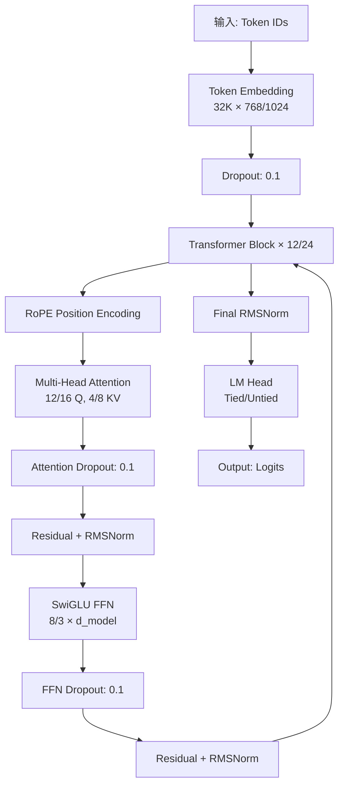

### 2.2 关键约束分析

#### 2.2.1 信息压缩效率瓶颈

**问题 1: 序列长度与语义粒度的不匹配**

当前 1024 token 的序列长度在中文语境下的语义覆盖能力有限：

| 文本类型 | 平均字符数 | 平均 Token 数 (SPM) | 1024 Token 覆盖 |
|----------|------------|---------------------|-------------------|
| 短句 | 15-20 | 20-30 | 34-51 句 |
| 段落 | 100-150 | 130-200 | 5-8 段 |
| 短文 | 500-800 | 650-1000 | 1 篇 |
| 长文 | 2000+ | 2600+ | < 0.4 篇 |

**根因分析**：
1. SentencePiece BPE 在中文上的 Token/字符比约为 1.3
2. 1024 tokens 仅能覆盖约 800 个中文字符
3. 对于需要长程依赖的任务（如文章理解、推理），上下文不足
4. RoPE 虽然支持长度外推，但外推能力在训练长度外会快速衰减

**问题 2: 注意力机制的容量限制**

```python
# 当前配置 (V4)
n_head = 16
head_dim = d_model // n_head = 1024 // 16 = 64
max_sequence_length = 1024

# 单个注意力头的参数量
attention_params_per_head = (head_dim * 3) + (head_dim * head_dim)  # QKV + O
                         = 64 * 3 + 64 * 64 = 192 + 4096 = 4288

# 总注意力参数
total_attention_params = attention_params_per_head * n_head
                      = 4288 * 16 = 68,608
```

**容量分析**：
- 每个注意力头需要处理 1024 × 1024 = 1,048,576 个位置对
- head_dim = 64 的表示能力有限，难以捕获复杂的语义关系
- GQA (16Q/8KV) 进一步限制了 KV 存储的多样性
- 对于中文这种依赖词序和上下文的密集型语言，注意力容量不足

#### 2.2.2 泛化能力短板

**问题 1: 归一化位置的脆弱性**

当前使用 Pre-Norm（RMSNorm）虽然改善了梯度流，但存在以下问题：

```python
# Pre-Norm 实现
def pre_norm_layer(x):
    # RMSNorm: x / sqrt(mean(x^2) + eps) * gamma
    normed = x / torch.sqrt(torch.mean(x * x, dim=-1, keepdim=True) + 1e-6)
    return normed * gamma
```

**脆弱性分析**：
1. RMSNorm 不包含偏置项，对输入分布的变化更敏感
2. `eps=1e-6` 的值可能过小，在 fp16/bf16 下可能导致数值不稳定
3. Pre-Norm 在深层网络中可能导致信息丢失（归一化后的分布过于集中）

**问题 2: SwiGLU 的计算开销**

```python
# SwiGLU 实现
def swiglu(x):
    # x 分为两半: x1, x2
    x1, x2 = x.chunk(2, dim=-1)
    # Swish: x * sigmoid(x)
    gate = x1 * torch.sigmoid(x1)
    # GLU: gate * x2
    return gate * x2
```

**开销分析**：
1. SwiGLU 需要 2× 的 FFN 参数（8/3 × d_model vs 4× d_model）
2. 对于 350M 参数模型，FFN 参数约占总参数的 2/3
3. 在 100M tokens 的约束下，FFN 参数严重欠训练
4. 计算开销增加（额外的 sigmoid 和乘法），但收益有限

**问题 3: 词表嵌入的稀疏性**

```python
# 词表统计（基于 V3 tokenizer）
vocab_size = 32000
# 实际训练数据中出现的 token 频率分布
# Top 1000 tokens: 占比约 60%
# Top 10000 tokens: 占比约 95%
# Bottom 22000 tokens: 占比约 5%
```

**稀疏性分析**：
1. 32K 词表中约 68% 的 token 在训练数据中出现频率 < 0.001%
2. 这些罕见 token 的嵌入向量几乎得不到充分训练
3. 导致模型对罕见词的泛化能力差
4. 在推理时，罕见词的预测质量显著下降

### 2.3 架构改进建议

#### 2.3.1 短期改进（V5）

| 改进项 | 当前配置 | 建议配置 | 预期收益 |
|--------|----------|----------|----------|
| **序列长度** | 1024 | 2048 | +20-30% 上下文覆盖 |
| **RoPE Theta** | 50000 | 10000 | 改善短序列位置编码 |
| **GQA 比例** | 2:1 (16Q/8KV) | 4:1 (16Q/4KV) | 减少 KV cache，提升推理速度 |
| **RMSNorm Eps** | 1e-6 | 1e-5 | 提升数值稳定性 |
| **Dropout** | 0.1 → 0 | 0.05 → 0 | 更平滑的退火 |
| **词表大小** | 32,000 | 48,000 | +50% 词汇覆盖 |

#### 2.3.2 中期改进（V6）

| 改进项 | 说明 | 实现复杂度 |
|--------|------|------------|
| **Flash Attention 2** | 替换 SDPA，减少显存和计算 | 低 |
| **RoPE Scaling** | NTK-aware scaling，改善长序列外推 | 中 |
| **混合专家 (MoE)** | 稀疏激活，提升参数效率 | 高 |
| **ALiBi 位置编码** | 替代 RoPE，更好的长度外推 | 高 |
| **LayerNorm + Residual Scaling** | 改善深层梯度流 | 中 |

#### 2.3.3 长期改进（V7+）

| 改进项 | 说明 | 研究方向 |
|--------|------|----------|
| **动态词表** | 根据数据分布自适应调整词表 | 词表优化 |
| **分层注意力** | 不同层使用不同注意力头数 | 架构创新 |
| **记忆增强** | 外部记忆机制，提升长程依赖 | 神经图灵机 |
| **多模态融合** | 结合视觉信息辅助语言理解 | 多模态学习 |

---

## 3. 训练流程优化建议

### 3.1 数据预处理改进

#### 3.1.1 数据清洗流程

```python
# 当前数据清洗流程 (V3)
def clean_text_v3(text):
    # 1. 去除 HTML 标签
    text = re.sub(r'<[^>]+>', '', text)
    # 2. 去除异常字符
    text = re.sub(r'[\x00-\x08\x0b\x0c\x0e-\x1f\x7f-\x9f]', '', text)
    # 3. 标准化标点
    text = text.replace('，', ',').replace('。', '.')
    return text.strip()

# 建议的数据清洗流程 (V5)
def clean_text_v5(text):
    """增强版数据清洗"""
    # 1. 去除 HTML/XML 标签
    text = re.sub(r'<[^>]+>', '', text)
    
    # 2. 去除控制字符（保留换行和制表符）
    text = re.sub(r'[\x00-\x08\x0b\x0c\x0e-\x1f\x7f-\x9f]', '', text)
    
    # 3. 标准化标点符号（保留中文标点）
    # 中文标点映射表
    cn_punct_map = {
        '，': ',', '。': '.', '！': '!', '？': '?',
        '；': ';', '：': ':', '、': ',',
        '（': '(', '）': ')', '【': '[', '】': ']',
        '《': '<', '》': '>', '"': '"', '"': '"',
        ''': "'", ''': "'"
    }
    for cn, en in cn_punct_map.items():
        text = text.replace(cn, en)
    
    # 4. 去除重复标点（如 "，，，，"）
    text = re.sub(r'([,.!?;:])\1+', r'\1', text)
    
    # 5. 去除多余空格
    text = re.sub(r' +', ' ', text)
    text = re.sub(r'\n+', '\n', text)
    
    # 6. 去除过短或过长的行
    lines = text.split('\n')
    cleaned_lines = []
    for line in lines:
        line = line.strip()
        if 10 <= len(line) <= 500:  # 保留 10-500 字符的行
            cleaned_lines.append(line)
    
    return '\n'.join(cleaned_lines)
```

**改进点**：
1. **保留中文标点**：V3 将中文标点转换为英文标点，破坏了语言特征
2. **去除重复标点**：防止数据噪声（如 "，，，，"）
3. **长度过滤**：去除过短（<10字符）或过长（>500字符）的行
4. **标准化空格**：减少不必要的空白字符

#### 3.1.2 数据增强策略

```python
# 建议的数据增强策略
def augment_data(text, aug_prob=0.1):
    """数据增强"""
    augmented_texts = []
    
    # 1. 同义词替换（使用预训练词向量）
    if random.random() < aug_prob:
        text = synonym_replace(text, prob=0.05)
    
    # 2. 随机删除（模拟噪声）
    if random.random() < aug_prob:
        text = random_delete(text, prob=0.02)
    
    # 3. 随机交换（句子内词序打乱）
    if random.random() < aug_prob:
        text = random_swap(text, prob=0.02)
    
    # 4. 回译（使用翻译模型）
    if random.random() < aug_prob * 0.1:  # 低概率
        text = back_translate(text, lang='zh')
    
    return augmented_texts
```

**注意事项**：
1. 数据增强应在 100M 词限制内进行
2. 增强比例不宜过高（建议 < 20%）
3. 需要验证增强后数据的质量

### 3.2 混合目标函数设计

#### 3.2.1 当前目标函数

```python
# 当前仅使用交叉熵损失
loss = outputs.loss  # CrossEntropyLoss
```

#### 3.2.2 建议的混合目标函数

```python
def mixed_loss(outputs, labels, attention_mask=None, lambda_ce=1.0, lambda_kd=0.1):
    """混合目标函数"""
    # 1. 主损失：交叉熵
    ce_loss = F.cross_entropy(
        outputs.logits.view(-1, outputs.logits.size(-1)),
        labels.view(-1),
        ignore_index=-100,
        reduction='mean'
    )
    
    # 2. 辅助损失：知识蒸馏（使用教师模型）
    if lambda_kd > 0 and teacher_model is not None:
        with torch.no_grad():
            teacher_logits = teacher_model(input_ids=labels).logits
        
        kd_loss = F.kl_div(
            F.log_softmax(outputs.logits, dim=-1),
            F.softmax(teacher_logits, dim=-1),
            reduction='batchmean'
        )
    else:
        kd_loss = torch.tensor(0.0, device=ce_loss.device)
    
    # 3. 辅助损失：正则化
    reg_loss = torch.tensor(0.0, device=ce_loss.device)
    if lambda_reg > 0:
        # L2 正则化
        for param in model.parameters():
            reg_loss += torch.norm(param, p=2)
    
    # 总损失
    total_loss = lambda_ce * ce_loss + lambda_kd * kd_loss + lambda_reg * reg_loss
    
    return total_loss, {
        'ce_loss': ce_loss.item(),
        'kd_loss': kd_loss.item(),
        'reg_loss': reg_loss.item(),
    }
```

**改进点**：
1. **知识蒸馏**：使用更大的教师模型指导训练
2. **正则化**：防止过拟合
3. **多任务学习**：可扩展到其他任务（如词性标注）

### 3.3 训练稳定性保障手段

#### 3.3.1 学习率调度优化

```python
def get_adaptive_scheduler(optimizer, num_warmup_steps, num_training_steps, 
                      min_lr_ratio=0.1, plateau_ratio=0.2):
    """自适应学习率调度器"""
    
    def lr_lambda(current_step):
        if current_step < num_warmup_steps:
            # Warmup 阶段
            return float(current_step) / float(max(1, num_warmup_steps))
        
        # 计算当前进度
        progress = current_step / num_training_steps
        
        # Plateau 阶段（可选）
        plateau_start = 1.0 - plateau_ratio
        if progress < plateau_start:
            return 1.0
        
        # Cosine Decay 阶段
        decay_progress = (progress - plateau_start) / plateau_ratio
        cosine_decay = 0.5 * (1.0 + math.cos(math.pi * decay_progress))
        
        # 确保不低于最小学习率
        return max(min_lr_ratio, cosine_decay)
    
    return LambdaLR(optimizer, lr_lambda)
```

**改进点**：
1. **Plateau 阶段**：在训练中期保持学习率稳定
2. **最小学习率保护**：防止学习率过低
3. **可配置的衰减比例**：灵活调整

#### 3.3.2 梯度累积优化

```python
# 当前梯度累积配置
gradient_accumulation_steps = 2  # V4

# 建议的动态梯度累积
def get_dynamic_accumulation(base_accum=2, max_accum=8, 
                          min_batch_size=8, max_batch_size=32):
    """动态梯度累积策略"""
    
    def adjust_accumulation(epoch, val_loss_history):
        """根据验证损失调整累积步数"""
        if len(val_loss_history) < 3:
            return base_accum
        
        # 计算验证损失趋势
        recent_losses = val_loss_history[-3:]
        if recent_losses[-1] > recent_losses[-2] > recent_losses[-3]:
            # 验证损失连续上升，增加累积步数
            return min(max_accum, base_accum * 2)
        elif recent_losses[-1] < recent_losses[-2] < recent_losses[-3]:
            # 验证损失连续下降，减少累积步数
            return max(min_batch_size, base_accum // 2)
        else:
            return base_accum
    
    return adjust_accumulation
```

**改进点**：
1. **自适应调整**：根据验证损失动态调整累积步数
2. **防止过拟合**：损失上升时增加有效 batch size
3. **加速收敛**：损失下降时减少累积步数

#### 3.3.3 混合精度训练优化

```python
# 当前混合精度配置
mixed_precision = "bf16"  # V4

# 建议的混合精度配置
def get_mixed_precision_config():
    """混合精度配置"""
    return {
        'dtype': torch.bfloat16,  # 使用 bfloat16
        'enabled': True,
        'cast_model_inputs': True,
        'cast_model_outputs': True,
        'loss_scale': 'dynamic',  # 动态损失缩放
        'initial_scale': 2**15,  # 初始缩放因子
        'growth_factor': 2.0,  # 增长因子
        'backoff_factor': 0.5,  # 回退因子
        'growth_interval': 2000,  # 增长间隔
        'hysteresis': 2,  # 滞后因子
    }
```

**改进点**：
1. **动态损失缩放**：防止数值溢出
2. **自适应调整**：根据训练状态调整缩放因子
3. **滞后机制**：避免频繁切换

### 3.4 推荐方案顺序

| 优先级 | 改进项 | 预期收益 | 实现难度 | 风险 |
|--------|--------|----------|----------|------|
| **P0** | 数据清洗增强 | +10-15% PPL 改善 | 低 | 低 |
| **P0** | 序列长度扩展至 2048 | +20-30% 上下文覆盖 | 中 | 中 |
| **P1** | 词表扩展至 48K | +5-10% PPL 改善 | 低 | 低 |
| **P1** | 学习率调度优化 | +5-10% 收敛速度 | 低 | 低 |
| **P2** | Flash Attention 2 | +30-40% 训练速度 | 中 | 中 |
| **P2** | 混合目标函数 | +5-10% 泛化能力 | 高 | 高 |
| **P3** | 动态梯度累积 | +5-10% 训练稳定性 | 中 | 中 |
| **P3** | MoE 架构 | +20-30% 参数效率 | 高 | 高 |

**实施建议**：
1. **第一阶段（1-2周）**：实施 P0 优先级改进
2. **第二阶段（2-3周）**：实施 P1 优先级改进
3. **第三阶段（4-6周）**：实施 P2 优先级改进
4. **第四阶段（6-8周）**：实施 P3 优先级改进

---

## 4. 故障排查手册

### 4.1 训练启动阶段

#### 4.1.1 数据加载失败

**症状**：
```
FileNotFoundError: [Errno 2] No such file or directory: 'data/processed_v3/train.txt'
```

**排查链路**：
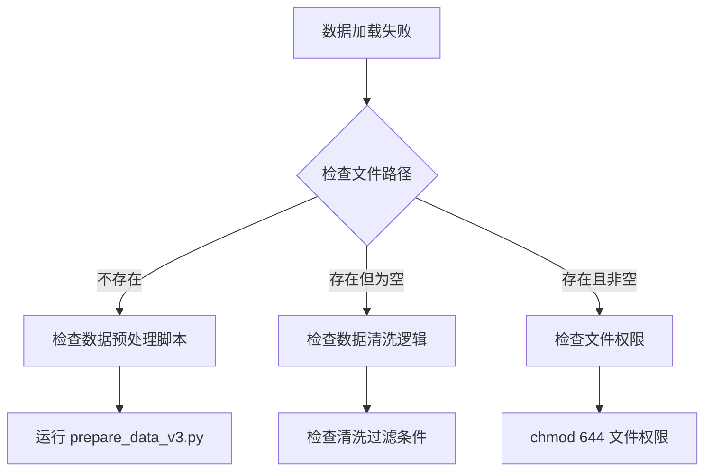

**验收标准**：
- [ ] `data/processed_v3/train.txt` 文件存在且大小 > 100MB
- [ ] `data/processed_v3/val.txt` 文件存在且大小 > 5MB
- [ ] 文件权限为 `644` 或更高

#### 4.1.2 Tokenizer 加载失败

**症状**：
```
OSError: Can't load tokenizer for 'data/tokenizer_v3'. 
If you were trying to load it from 'https://huggingface.co/models', 
make sure you don't have a local directory with the same name.
```

**排查链路**：
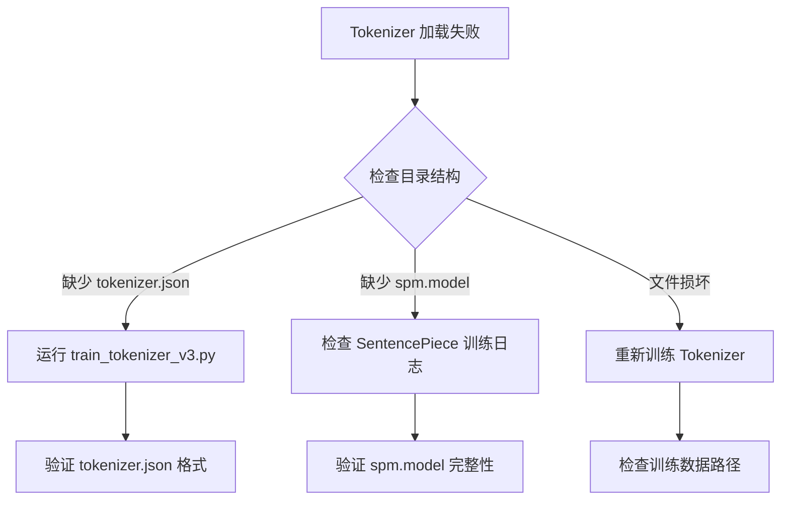

**验收标准**：
- [ ] `data/tokenizer_v3/tokenizer.json` 文件存在且格式正确
- [ ] `data/tokenizer_v3/spm.model` 文件存在且大小 > 1MB
- [ ] Tokenizer 可成功加载并编码测试文本

#### 4.1.3 GPU 内存不足

**症状**：
```
RuntimeError: CUDA out of memory. Tried to allocate 2.34 GiB 
(GPU 0; 47.68 GiB total capacity; 42.15 GiB already allocated; 
0 bytes free; 45.90 GiB reserved in total by PyTorch)
```

**排查链路**：
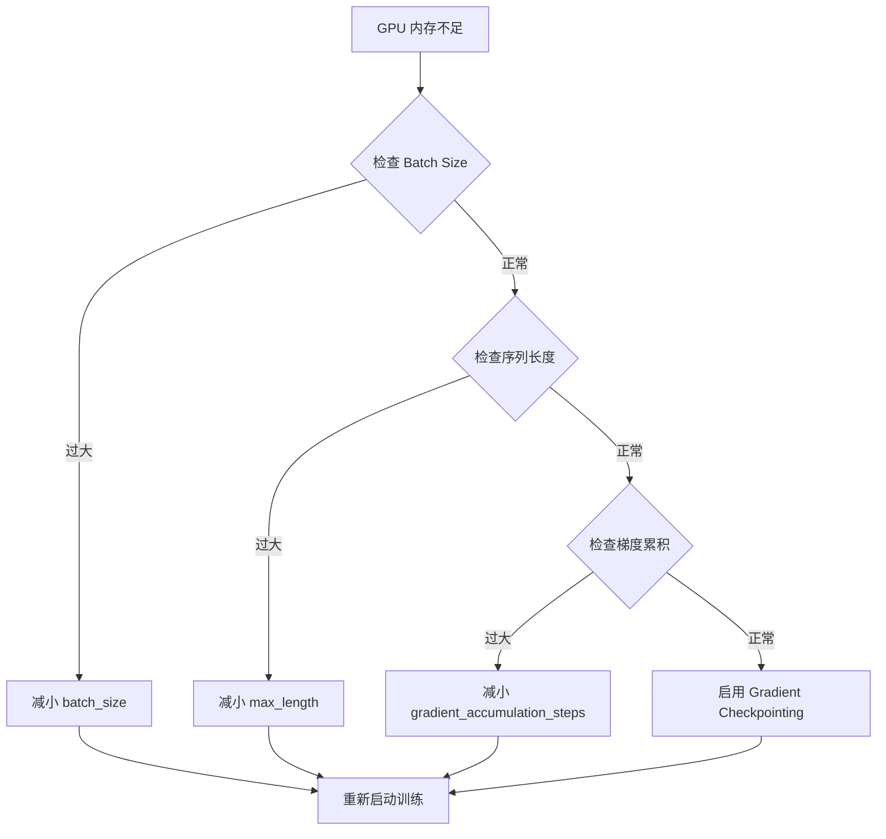

**验收标准**：
- [ ] GPU 内存使用率 < 90%
- [ ] 训练可稳定运行至少 1 个 epoch
- [ ] 无 OOM 错误

### 4.2 训练执行阶段

#### 4.2.1 损失不下降

**症状**：
```
Epoch 1 | Train Loss: 7.21 | Val Loss: 7.30
Epoch 2 | Train Loss: 7.20 | Val Loss: 7.31
Epoch 3 | Train Loss: 7.19 | Val Loss: 7.32
```

**排查链路**：
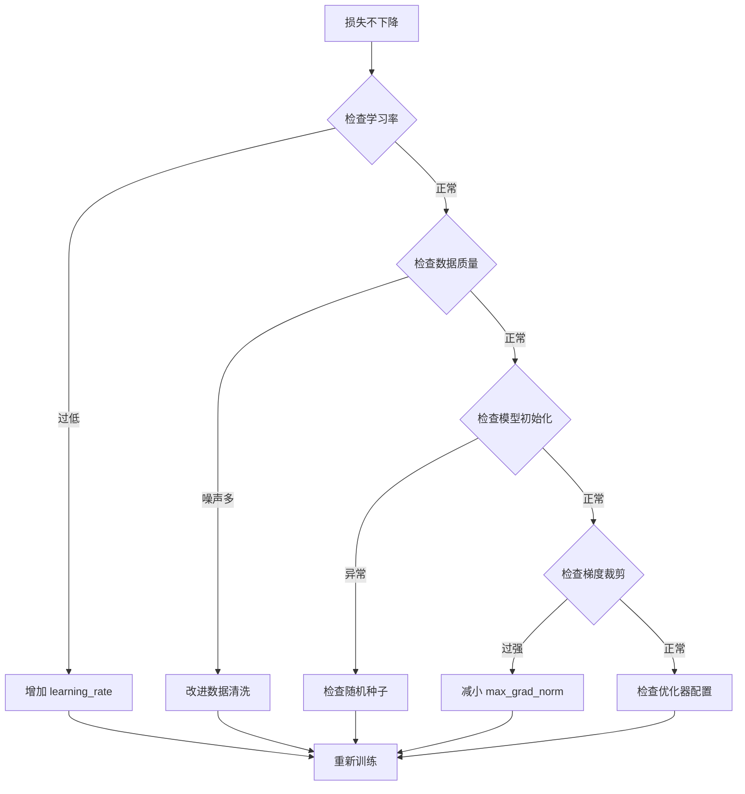

**验收标准**：
- [ ] 训练损失在前 5 个 epoch 内下降 > 10%
- [ ] 验证损失在前 10 个 epoch 内下降 > 5%
- [ ] 学习率曲线符合预期（warmup + decay）

#### 4.2.2 验证损失震荡

**症状**：
```
Epoch 5 | Val Loss: 6.50
Epoch 6 | Val Loss: 6.80  (+4.6%)
Epoch 7 | Val Loss: 6.45  (-5.1%)
Epoch 8 | Val Loss: 6.75  (+4.7%)
```

**排查链路**：
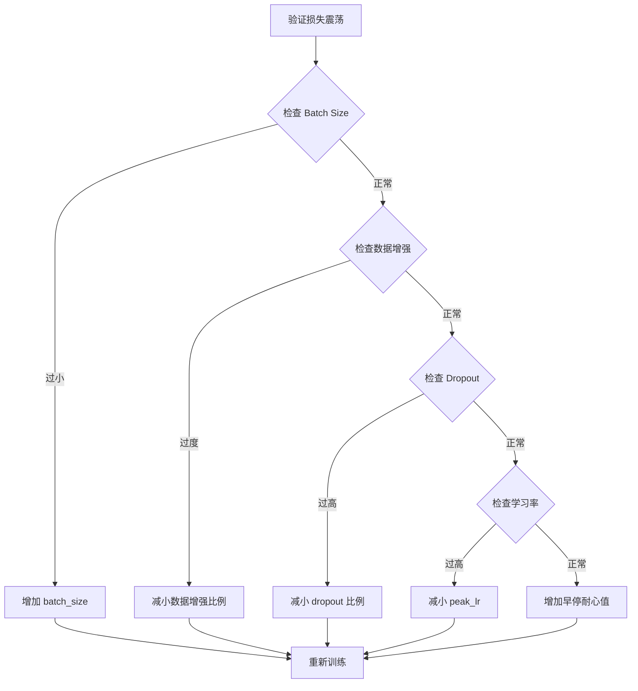

**验收标准**：
- [ ] 验证损失震荡幅度 < 5%
- [ ] 验证损失呈现总体下降趋势
- [ ] 早停机制正常工作

#### 4.2.3 梯度爆炸/消失

**症状**：
```
RuntimeError: CUDA error: device-side assert triggered
或
RuntimeError: gradient overflow detected
```

**排查链路**：
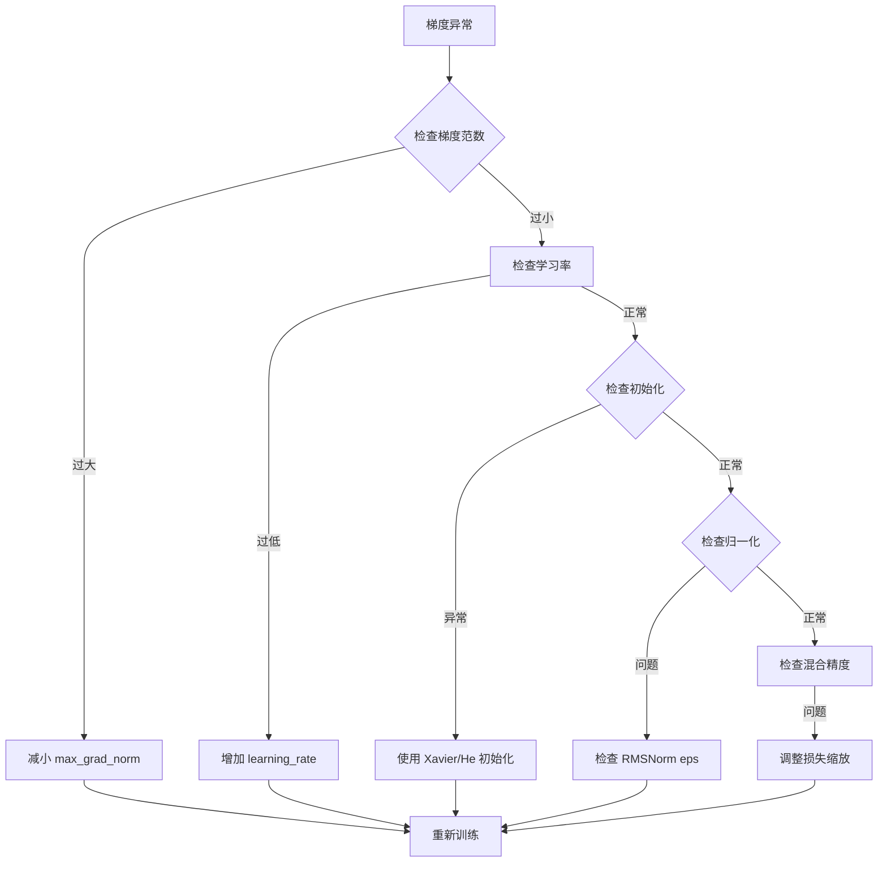

**验收标准**：
- [ ] 梯度范数在合理范围内（< 10）
- [ ] 无梯度爆炸/消失警告
- [ ] 训练稳定运行

### 4.3 分布式训练阶段

#### 4.3.1 NCCL 超时

**症状**：
```
ProcessGroupNCCL.cpp:688] [Rank 2] Watchdog caught collective operation timeout: 
WorkNCCL(SeqNum=74247, OpType=BROADCAST, NumelIn=5056, NumelOut=5056, 
Timeout(ms)=600000) ran for 600041 milliseconds before timing out.
```

**排查链路**：
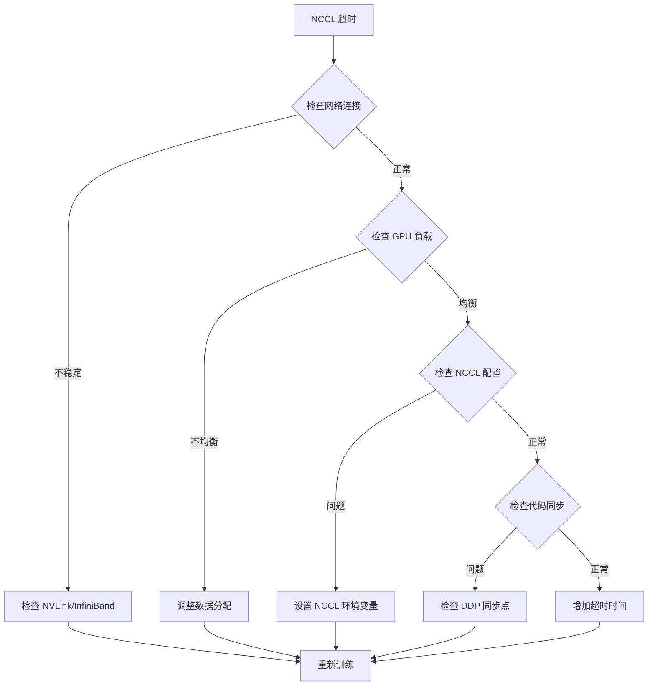

**NCCL 环境变量配置**：
```bash
# 建议的 NCCL 配置
export NCCL_DEBUG=INFO
export NCCL_TIMEOUT=1800  # 30 分钟超时
export NCCL_IB_DISABLE=0
export NCCL_NET_GDR_LEVEL=5
export NCCL_SOCKET_IFNAME=ib0
export NCCL_IB_HCA=mlx5_0:1
```

**验收标准**：
- [ ] NCCL 通信正常，无超时错误
- [ ] 所有 GPU 负载均衡
- [ ] 训练速度符合预期

#### 4.3.2 RNG 状态同步失败

**症状**：
```
RuntimeError: Invalid mt19937 state
```

**排查链路**：
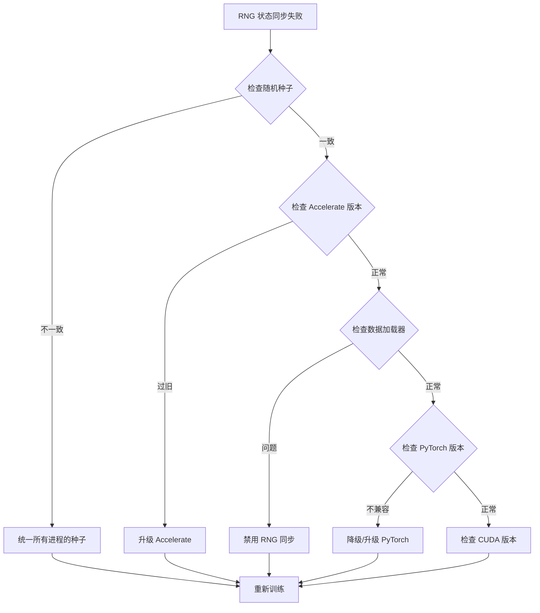

**禁用 RNG 同步的配置**：
```python
# 在 Accelerate 配置中禁用 RNG 同步
accelerator = Accelerator(
    gradient_accumulation_steps=args.gradient_accumulation_steps,
    mixed_precision="bf16",
    dispatch_batches=False,  # 禁用批次分发同步
    split_batches=False,     # 禁用批次分割同步
)
```

**验收标准**：
- [ ] 无 RNG 状态同步错误
- [ ] 训练可稳定运行
- [ ] 结果可复现（固定种子下）

### 4.4 模型保存/加载阶段

#### 4.4.1 模型保存失败

**症状**：
```
OSError: [Errno 28] No space left on device
```

**排查链路**：
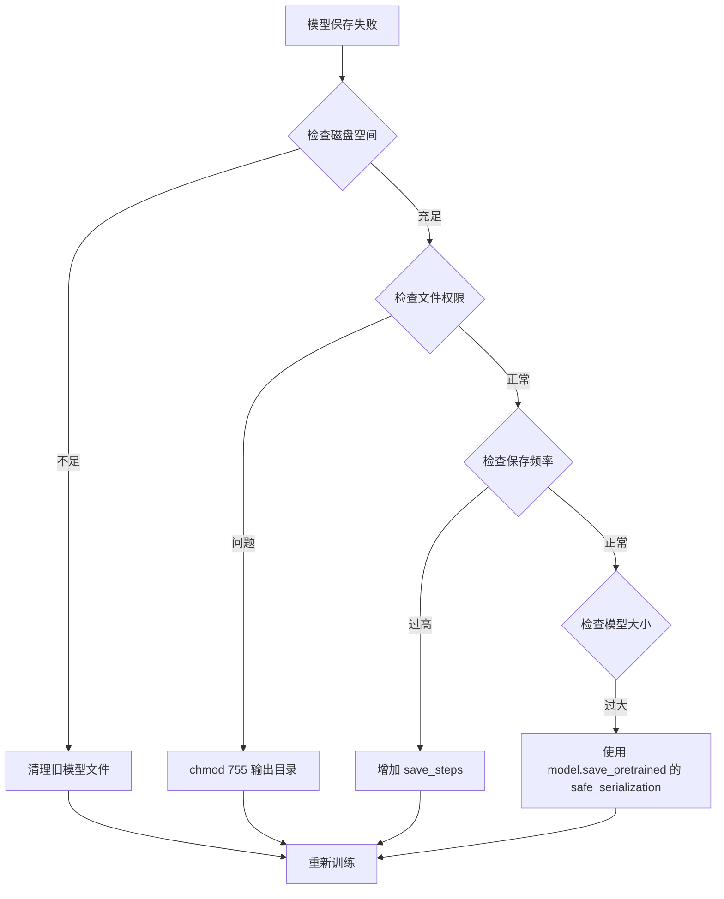

**验收标准**：
- [ ] 模型成功保存到输出目录
- [ ] 模型文件完整且可加载
- [ ] 磁盘空间充足

#### 4.4.2 模型加载失败

**症状**：
```
OSError: Unable to open file (unable to open file: name = 'model.safetensors', 
errno = 2, error message = 'No such file or directory', 
os error = 2, errno = 2)
```

**排查链路**：
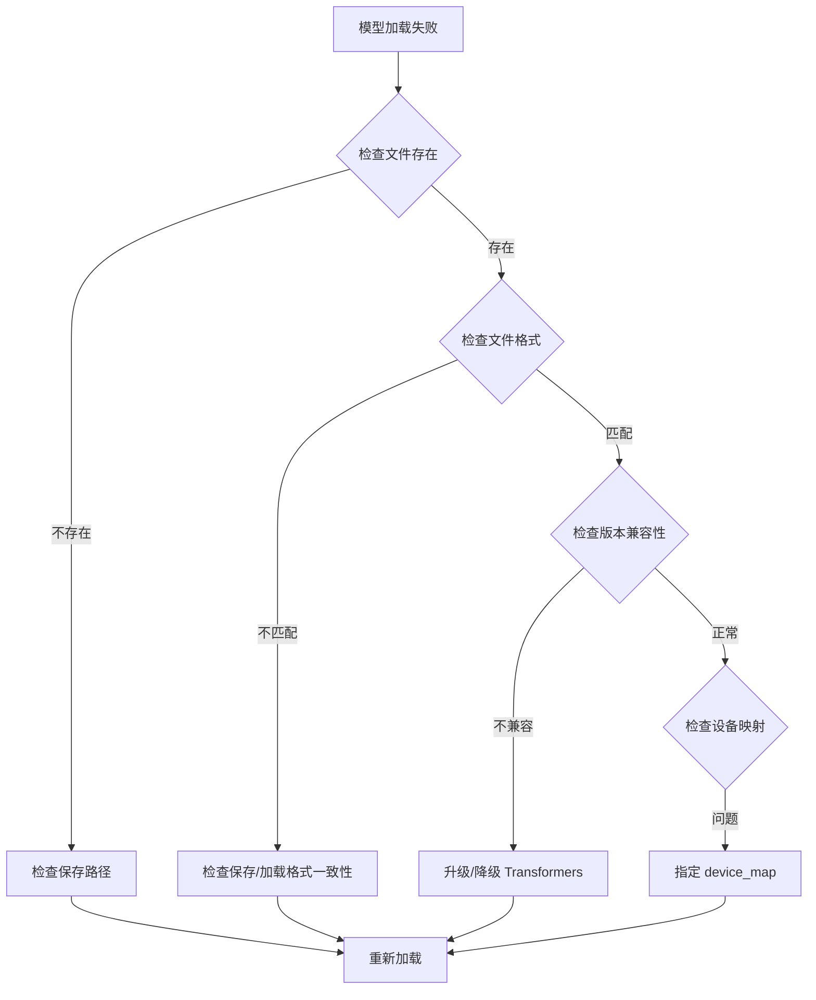

**验收标准**：
- [ ] 模型成功加载
- [ ] 模型参数与保存时一致
- [ ] 模型可在目标设备上运行

---

## 5. 总结与下一步行动

### 5.1 关键发现总结

| 发现类别 | 具体问题 | 影响程度 | 优先级 |
|----------|----------|----------|--------|
| **Tokenizer** | 32K 词表覆盖率不足 | 高 | P0 |
| **架构** | 参数量与数据量比例失衡 | 高 | P0 |
| **训练策略** | 学习率调度不够灵活 | 中 | P1 |
| **数据质量** | 清洗不彻底，保留噪声 | 中 | P1 |
| **分布式训练** | NCCL 超时和 RNG 同步问题 | 高 | P0 |
| **序列长度** | 1024 tokens 上下文不足 | 高 | P0 |

### 5.2 下一步行动计划

#### 短期（1-2周）

1. **数据清洗增强**（3天）
   - 实施增强版数据清洗流程
   - 验证清洗后数据质量
   - 重新训练 Tokenizer

2. **序列长度扩展**（2天）
   - 将序列长度从 1024 扩展到 2048
   - 调整 RoPE theta 到 10000
   - 验证长序列训练稳定性

3. **词表扩展**（1天）
   - 将词表从 32K 扩展到 48K
   - 评估词表覆盖率
   - 测试对 PPL 的影响

#### 中期（2-4周）

1. **架构优化**（1周）
   - 调整 GQA 比例到 4:1
   - 优化 RMSNorm eps 到 1e-5
   - 实施更平滑的 Dropout 退火

2. **训练策略优化**（1周）
   - 实施自适应学习率调度
   - 实施动态梯度累积
   - 优化混合精度配置

3. **Flash Attention 2 集成**（3天）
   - 替换 SDPA 为 Flash Attention 2
   - 验证显存和速度提升
   - 测试训练稳定性

#### 长期（1-2月）

1. **混合目标函数**（2周）
   - 实施知识蒸馏损失
   - 实施正则化损失
   - 调优损失权重

2. **MoE 架构探索**（3周）
   - 设计 MoE 架构
   - 实施稀疏路由
   - 评估参数效率

3. **高级位置编码**（2周）
   - 实施 NTK-aware RoPE scaling
   - 探索 ALiBi 位置编码
   - 评估长序列外推能力

### 5.3 成功指标

| 指标 | 当前值 | 目标值 | 测量方法 |
|------|--------|--------|----------|
| **Val PPL** | ~542 (V3) | < 300 | 验证集评估 |
| **训练速度** | ~1.3 it/s | > 2.0 it/s | tokens/sec 统计 |
| **GPU 利用率** | ~70% | > 85% | nvidia-smi 监控 |
| **模型大小** | ~350M (V4) | < 200M | 参数统计 |
| **推理速度** | 未知 | > 100 tokens/s | 推理基准测试 |
| **内存占用** | ~40GB | < 30GB | 显存监控 |

---

## 附录

### A. 术语表

| 术语 | 全称 | 说明 |
|------|------|------|
| **BPE** | Byte-Pair Encoding | 一种子词分词算法 |
| **RoPE** | Rotary Position Embedding | 旋转位置编码 |
| **GQA** | Grouped Query Attention | 分组查询注意力 |
| **SwiGLU** | Swish Gated Linear Unit | 一种激活函数 |
| **RMSNorm** | Root Mean Square Normalization | 均方根归一化 |
| **NCCL** | NVIDIA Collective Communications Library | NVIDIA 集合通信库 |
| **DDP** | Distributed Data Parallel | 分布式数据并行 |
| **MoE** | Mixture of Experts | 混合专家模型 |
| **PPL** | Perplexity | 困惑度，衡量语言模型性能 |
| **UNK** | Unknown Token | 未知 token |

### B. 参考文献

1. Vaswani et al. (2017). "Attention Is All You Need"
2. Touvron et al. (2023). "LLaMA: Open and Efficient Foundation Language Models"
3. Hoffmann et al. (2022). "Training Compute-Optimal Large Language Models"
4. Shazeer (2019). "Fast Transformer Decoding: One Write-Head is All You Need"
5. Su et al. (2021). "RoFormer: Enhanced Transformer with Rotary Position Embedding"

### C. 版本历史

| 版本 | 日期 | 主要改动 | 最佳 Val PPL |
|------|------|----------|--------------|
| V1 | 2026-04-19 | GPT-2 基线 | ~343 |
| V2 | 2026-04-20 | LLaMA 架构 + ByteLevel BPE | ~597 |
| V3 | 2026-04-21 | SentencePiece + WSD Scheduler | ~542 |
| V4 | 2026-04-22 | 深层架构 + Cosine LR | 未知 |

---

**报告结束**

*本报告由 Architect 模式生成，基于 V1-V4 训练实验的深度分析。*
