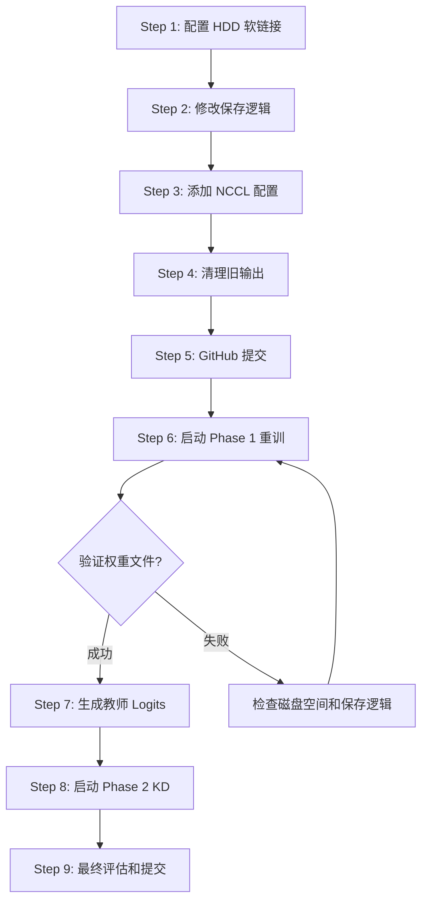

# V5 训练修复方案 + 版本管理计划

> **日期**: 2026-04-24  
> **状态**: 🔴 需要修复后重训  
> **根因**: SSD 空间不足 + 未配置 HDD 软链接 → 模型权重丢失

---

## 1. 问题根因分析

### 1.1 文件系统架构

```
SSD (固态硬盘 - 空间有限)
└── /home/kehe/babyllm/babyLLM/
    ├── src/          ← 代码
    ├── data/         ← 数据
    ├── plans/        ← 文档
    └── output/       ← 训练输出
        ├── babylm-gpt2/       ← V1 (GPT-2)
        ├── babylm-llama-v2/   ← V2 (无权重文件，只有配置)
        ├── babylm-llama-v3/   ← V3 (无权重文件)
        └── babylm-llama-v5/   ← V5 (无权重文件! 只有配置)

HDD (机械硬盘 - /mnt/sda/kehe/)
├── babyllm_output/
│   └── babylm-llama-v4/       ← V4 (有权重! 通过软链接)
│       ├── best_model/
│       │   └── model.safetensors  ← ✅ 存在
│       ├── checkpoint-50000/
│       │   └── model.safetensors  ← ✅ 存在
│       └── checkpoint-55000/
│           └── model.safetensors  ← ✅ 存在
└── babyllm_backup/
    └── babylm-llama-v2-checkpoints/  ← V2 checkpoints 备份
```

### 1.2 问题链

1. **V4 曾因 SSD 空间不足报错**: `safetensors_rust.SafetensorError: I/O error: No space left on device (os error 28)`
2. **V4 后来通过软链接解决**: `output/babylm-llama-v4/` → `/mnt/sda/kehe/babyllm_output/babylm-llama-v4/`
3. **V5 未配置软链接**: 训练输出直接写入 SSD 的 `output/babylm-llama-v5/`
4. **`save_pretrained()` 静默失败**: SSD 空间不足时，只保存了配置文件（JSON），权重文件（`model.safetensors`）写入失败但未抛出异常
5. **训练日志误导**: 显示 "Writing model shards: 100%" 但实际权重未写入

### 1.3 V5 模型大小估算

- 参数量: 50,993,664 (51M)
- FP32 权重: ~194 MB
- BF16 权重: ~97 MB
- SafeTensors 格式: ~97-194 MB
- 每个 checkpoint + best_model ≈ 200-400 MB
- 总共需要: ~1-2 GB (含多个 checkpoint)

---

## 2. 修复方案

### 2.1 Step 1: 配置 V5 输出目录软链接

```bash
# 1. 在机械硬盘上创建 V5 输出目录
mkdir -p /mnt/sda/kehe/babyllm_output/babylm-llama-v5

# 2. 清理 SSD 上不完整的 V5 输出
# 先备份配置文件
cp -r /home/kehe/babyllm/babyLLM/output/babylm-llama-v5/config.json /tmp/v5_config_backup.json
cp -r /home/kehe/babyllm/babyLLM/output/babylm-llama-v5/train_v5_pretrain.log /tmp/v5_log_backup.log

# 3. 删除 SSD 上的不完整目录
rm -rf /home/kehe/babyllm/babyLLM/output/babylm-llama-v5

# 4. 创建软链接
ln -s /mnt/sda/kehe/babyllm_output/babylm-llama-v5 /home/kehe/babyllm/babyLLM/output/babylm-llama-v5

# 5. 验证软链接
ls -la /home/kehe/babyllm/babyLLM/output/babylm-llama-v5
```

### 2.2 Step 2: 修改 train_v5.py 保存逻辑

在 `save_pretrained()` 后增加**保存验证**和**磁盘空间检查**:

```python
import shutil

def safe_save_model(model, output_dir, accelerator, config, tokenizer):
    """安全保存模型，带磁盘空间检查和保存验证"""
    # 检查磁盘空间
    disk_usage = shutil.disk_usage(output_dir)
    free_gb = disk_usage.free / (1024**3)
    
    # 估算所需空间 (FP32 参数量 × 4 bytes × 1.5 安全系数)
    total_params = sum(p.numel() for p in model.parameters())
    required_gb = total_params * 4 * 1.5 / (1024**3)
    
    if free_gb < required_gb:
        logger.warning(f"磁盘空间不足! 可用: {free_gb:.1f}GB, 需要: {required_gb:.1f}GB")
    
    # 保存模型
    unwrapped = accelerator.unwrap_model(model)
    unwrapped.save_pretrained(output_dir)
    config.save_pretrained(output_dir)
    tokenizer.save_pretrained(output_dir)
    
    # 验证权重文件是否存在
    import glob
    weight_files = (
        glob.glob(os.path.join(output_dir, "model.safetensors")) +
        glob.glob(os.path.join(output_dir, "model-*.safetensors")) +
        glob.glob(os.path.join(output_dir, "pytorch_model.bin"))
    )
    
    if not weight_files:
        logger.error(f"权重文件保存失败! 尝试使用 torch.save fallback...")
        # Fallback: 使用 torch.save
        state_dict = accelerator.get_state_dict(model)
        fallback_path = os.path.join(output_dir, "pytorch_model.bin")
        torch.save(state_dict, fallback_path)
        logger.info(f"Fallback 保存成功: {fallback_path}")
        
        # 再次验证
        if not os.path.exists(fallback_path):
            raise RuntimeError(f"模型保存完全失败! 请检查磁盘空间: {output_dir}")
    
    total_size = sum(os.path.getsize(f) for f in weight_files)
    logger.info(f"模型保存验证通过: {len(weight_files)} 个文件, 总大小: {total_size / 1024**2:.1f} MB")
```

### 2.3 Step 3: 添加 NCCL 超时配置

在 `launch_v5.sh` 中添加:

```bash
export NCCL_TIMEOUT=1800000    # 30 分钟超时 (ms)
export NCCL_IB_DISABLE=1       # 单机不需要 InfiniBand
export NCCL_P2P_LEVEL=SYS      # 跨 GPU 通信
export NCCL_DEBUG=WARN         # 只显示警告
export TORCH_NCCL_ASYNC_ERROR_HANDLING=1  # 异步错误处理
```

### 2.4 Step 4: 清理并重训

```bash
# 1. 清理旧的 wandb 日志
rm -rf /home/kehe/babyllm/babyLLM/src/v5/wandb/

# 2. 确认 GPU 可用
nvidia-smi

# 3. 启动训练
cd /home/kehe/babyllm/babyLLM
tmux new -s babylm_v5_retrain
bash launch_v5.sh 2>&1 | tee output/train_v5_phase1_r2.log
```

---

## 3. 版本管理计划

### 3.1 Git 仓库结构

```
babyLLM/
├── .gitignore              ← 已配置忽略 output/, *.bin, *.safetensors
├── README.md
├── REPORT.md               ← V1/V2 实验报告
├── requirements.txt
├── docs/
│   ├── SERVER_INSTRUCTIONS.md
│   └── ANALYSIS_AND_OPTIMIZATION.md
├── plans/
│   ├── POST_MORTEM_ANALYSIS_V1_V4.md  ← V1-V4 分析报告
│   ├── V5_TRAINING_PLAN.md            ← V5 训练计划
│   └── V5_TRAINING_STATUS_REPORT.md   ← V5 状态报告
├── src/
│   ├── v1/                 ← V1 GPT-2 代码
│   ├── v2/                 ← V2 LLaMA 代码
│   ├── v3/                 ← V3 LLaMA+SPM 代码
│   │   ├── train_v3.py
│   │   ├── spm_tokenizer.py
│   │   └── TRAINING_LOG_V3.md
│   ├── v4/                 ← V4 LLaMA deep 代码
│   │   └── train_v4.py
│   └── v5/                 ← V5 KD 代码 (新增)
│       ├── train_v5.py
│       └── generate_teacher_logits.py
├── launch_v4.sh
├── launch_v5.sh            ← V5 Phase 1 启动脚本
└── launch_v5_kd.sh         ← V5 Phase 2 KD 启动脚本
```

### 3.2 GitHub 提交计划

```bash
# 1. 检查当前状态
cd /home/kehe/babyllm/babyLLM
git status

# 2. 添加 V5 相关文件
git add src/v5/train_v5.py
git add src/v5/generate_teacher_logits.py
git add launch_v5.sh
git add launch_v5_kd.sh
git add plans/V5_TRAINING_PLAN.md
git add plans/V5_TRAINING_STATUS_REPORT.md
git add plans/V5_FIX_PLAN.md
git add plans/POST_MORTEM_ANALYSIS_V1_V4.md

# 3. 提交
git commit -m "feat: V5 training pipeline with knowledge distillation

- V5 architecture: LLaMA 51M params (512d, 12L, 8Q/4KV GQA)
- Two-phase training: Phase 1 CE pretrain → Phase 2 KD
- White-box KD based on DistilQwen2.5 (top-K logits, temperature scaling)
- Teacher model: Qwen2.5-0.5B
- Offline teacher logits generation script
- Phase 1 results: Val PPL 525.21 (Epoch 6, best among V2-V5)
- Fix plan for SSD space issue (symlink to HDD)
- NCCL timeout configuration
- Comprehensive training logs and analysis documents"

# 4. 推送
git push origin main
```

### 3.3 .gitignore 更新建议

当前 `.gitignore` 已正确配置:
- `output/` — 忽略所有训练输出
- `*.bin`, `*.safetensors`, `*.pt` — 忽略权重文件
- `wandb/` — 忽略 WandB 日志
- `*.log` — 忽略日志文件

**建议添加**:
```gitignore
# 软链接相关的权重目录（不应提交）
/mnt/sda/kehe/babyllm_output/
```

---

## 4. 存储管理规范

### 4.1 今后所有版本的输出目录配置

每个新版本的训练输出**必须**软链接到机械硬盘:

```bash
# 模板: 为新版本 V{N} 创建软链接
VERSION=v6  # 替换为实际版本号
mkdir -p /mnt/sda/kehe/babyllm_output/babylm-llama-${VERSION}
rm -rf /home/kehe/babyllm/babyLLM/output/babylm-llama-${VERSION}  # 删除已有目录
ln -s /mnt/sda/kehe/babyllm_output/babylm-llama-${VERSION} \
      /home/kehe/babyllm/babyLLM/output/babylm-llama-${VERSION}
```

### 4.2 磁盘空间监控

在训练脚本中添加启动前检查:

```python
import shutil

def check_disk_space(path, min_free_gb=10):
    """检查磁盘空间是否充足"""
    usage = shutil.disk_usage(path)
    free_gb = usage.free / (1024**3)
    if free_gb < min_free_gb:
        raise RuntimeError(
            f"磁盘空间不足! 可用: {free_gb:.1f}GB, 最低需要: {min_free_gb}GB. "
            f"请将输出目录软链接到机械硬盘."
        )
    print(f"磁盘空间检查通过: {free_gb:.1f}GB 可用")
```

---

## 5. 执行顺序



### 详细步骤

| # | 任务 | 执行者 | 前置条件 |
|---|------|--------|---------|
| 1 | 创建 HDD 目录 + 软链接 | Code 模式 | 无 |
| 2 | 修改 `train_v5.py` 保存逻辑 | Code 模式 | Step 1 |
| 3 | 修改 `launch_v5.sh` NCCL 配置 | Code 模式 | Step 2 |
| 4 | 清理旧 V5 输出目录 | Code 模式 | Step 1 |
| 5 | Git commit + push | Code 模式 | Step 2-4 |
| 6 | 启动 Phase 1 重训 | Code 模式 | Step 5 |
| 7 | 验证权重文件完整性 | 手动检查 | Step 6 完成 |
| 8 | 生成教师模型 logits | Code 模式 | Step 7 |
| 9 | 启动 Phase 2 KD | Code 模式 | Step 8 |
| 10 | 最终评估 + 文档更新 | Architect 模式 | Step 9 |

---

## 6. V4 权重文件清单（可用于参考/教师模型）

| 路径 | 文件 | 说明 |
|------|------|------|
| `/mnt/sda/kehe/babyllm_output/babylm-llama-v4/best_model/` | `model.safetensors` | V4 最佳模型 |
| `/mnt/sda/kehe/babyllm_output/babylm-llama-v4/checkpoint-50000/` | `model.safetensors` | V4 step 50000 |
| `/mnt/sda/kehe/babyllm_output/babylm-llama-v4/checkpoint-55000/` | `model.safetensors` | V4 step 55000 |
| `/mnt/sda/kehe/babyllm_backup/babylm-llama-v2-checkpoints/` | 多个 checkpoint | V2 备份 |

**注意**: V4 模型 (350M params) 和 V5 模型 (51M params) 使用相同的 tokenizer (SPM 32K)，理论上 V4 可以作为 V5 KD 的教师模型。但 V4 本身训练不充分（因磁盘空间问题中断），建议使用 Qwen2.5-0.5B 作为教师模型。
